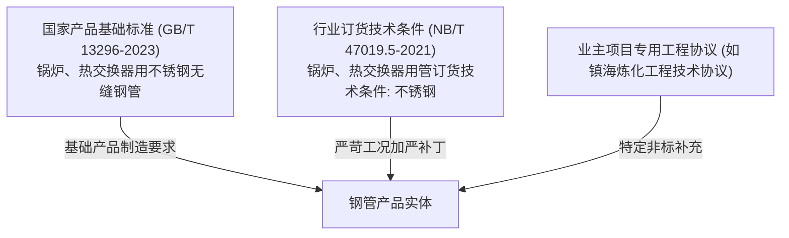

# 工业质保书多标准引用与合规比对引擎处理机制

> **专题定位**：本专题系统阐述当工业质量证明书（MTC）同时声明两份及以上技术标准（如通用产品标准 `GB/T 13296-2023` 与能源行业订货技术条件 `NB/T 47019.5-2021`）时，NormScale 比对引擎的领域建模、规则叠加、冲突仲裁与矩阵呈现规范。

---

## 1. 工业背景与标准层级定位

在石化工程、承压锅炉与核电热交换器等高端装备制造中，材料采购通常处于“双重或多重契约”之下：

- **通用产品制造标准（Base Standard）**：定义产品物理制造方式、基础外形尺寸、基准化学成分与通用力学出厂指标；
- **承压订货技术条件（Ordering Specification）**：针对压力管道防爆、耐腐蚀、抗疲劳等工况，对关键指标实施**指标加严（Tightening）、检验频次翻倍（Frequency Upgrade）与选做项强制化（Mandatory Conversion）**；
- **工程订货协议（Engineering Contract）**：补充包装支数、单管长度、指定交货表面粗糙度与第三方监检要求。

---

## 2. GB/T 13296 与 NB/T 47019.5（S32168 牌号）逐条款对比

| 检验项目 | GB/T 13296-2023 | NB/T 47019.5-2021 | 差异属性与引擎仲裁逻辑 |
|---|---|---|---|
| **断后伸长率 A** | $\ge 35.0\%$ | **$\ge 40.0\%$** | **重大加严**：订货标准将塑性储备门槛提高 5%。引擎合成门槛必须取 $\ge 40.0\%$ |
| **抗拉强度 Rm** | $\ge 520\text{ MPa}$ | Ⅰ/Ⅱ级：$\ge 520\text{ MPa}$；**TⅠ级：$520 \sim 730\text{ MPa}$** | **增加上限约束**：防止过度加工硬化脆性 |
| **屈服强度 Rp0.2** | $\ge 205\text{ MPa}$ | $\ge 205\text{ MPa}$ | 两者一致 |
| **化学成分 C、Si、Mn、P、S、Ni、Cr、Ti** | C $\le 0.08$, P $\le 0.035$, S $\le 0.015$ | 熔炼分析相同；**附录 A 增设优级标准**（S $\le 0.005\%$, P $\le 0.030\%$） | 默认一致；若合同指定优级，激活严苛门槛 |
| **晶间腐蚀试验** | 合同协商项（选做） | **规定的强制检验项目（MANDATORY）**，每批 2 根必做 GB/T 4334 方法 E | **等级升级**：由选做升级为强制项，未检即判缺失 |
| **无损检测 (超声探伤 UT)** | 逐根无损检验 | 逐根超声，对比样管人工缺陷锁定在 **U2 级** | 规范级别锁定 |
| **致密性 / 替代涡流** | 逐根水压或常规涡流（E3H） | 逐根水压（最高 20MPa 稳压 10s）；外径 $>25\text{mm}$ 替代涡流提升至 **E2H 级** | **重大加严**：涡流验收等级由 E3H 提高至 E2H |
| **硬度试验** | 壁厚 $\ge 1.7\text{mm}$ 时考核 $\le 200\text{ HV1}$；$<1.7\text{mm}$ 免检 | 壁厚 $\ge 1.7\text{mm}$ 时考核 $\le 200\text{ HV}$；$<1.7\text{mm}$ 免检 | 两者一致 |

---

## 3. NormScale 多标准比对引擎架构设计

### 3.1 规则叠加与严苛者优先原则（Strict Superiority Arbitration）

当批次同时关联标准集合 $\{S_1, S_2, \dots, S_n\}$ 时，引擎执行**规则叠加切片合成器（Rule Slice Overlay Composer）**：

1. **数值下限型指标（如抗拉强度、伸长率）**：
   $$\text{Req}_{\min} = \max\left(S_1.\min, S_2.\min, \dots, S_n.\min\right)$$
2. **数值上限型指标（如有害杂质 P、S 含量）**：
   $$\text{Req}_{\max} = \min\left(S_1.\max, S_2.\max, \dots, S_n.\max\right)$$
3. **检验要求等级（Requirement Level）**：
   $$\text{MANDATORY} \succ \text{CONDITIONAL} \succ \text{OPTIONAL\_AGREED} \succ \text{EXEMPT}$$
   *任一标准将其列为强制必检项，合成后即为强制必检项。*
4. **无损探伤与质量等级**：
   $$U2 \succ U2.5 \succ U3, \quad E2H \succ E3H \succ E4H$$
   *自动匹配更高缺陷检出灵敏度。*

### 3.2 矩阵多标尺透明追溯（Dual-Ruler Traceability）

在全景合规比对矩阵中，不能粗暴地只显示一个合成后的数字，必须保障**合规可追溯性（Compliance Explainability）**：

- **单项完全合格**：
  - 实测 $A = 62.5\%$
  - 标准要求显示：$\ge 40.0\%$ [NB] / $\ge 35.0\%$ [GB]
  - 偏差量：$+22.5\%$
  - 状态：`✓ PASS (双标均合格)`
- **落入加严剪刀差区间（边界失效）**：
  - 假设实测 $A = 38.0\%$
  - 状态：`✗ FAIL (未达标)`
  - 判定依据显示：`满足通用国标 GB/T 13296 (≥35%)，但不满足行业订货标准 NB/T 47019.5 (≥40%)，按就高严苛原则判定不合格`
  - *这为工程质量工程师提供了最关键的责任边界判定依据！*

---

## 4. 实施路径建议

1. **规则库层（Rule Store）**：已支持在 `data/standards/` 下并行维护 `GB_T_13296_2023` 与 `NB_T_47019_5_2021` 独立标准切片；
2. **切片合成层（Slice Composer）**：在 `ComplianceEngine` 中引入 `composeMultiStandardSlices(slices: SpecificationSlice[]): CompositeSlice`；
3. **前端工作台呈现（UI Layer）**：在全景合规比对矩阵的“执行标准要求”列，支持悬浮或紧凑展示多标准各自的要求明细标签。

---

## 5. 采购技术协议（Technical Agreement）优先级调度与法标放宽风险管控

### 5.1 优先级梯队（Priority & Override Hierarchy）
在工程与特种承压装备采购中，采购技术协议为买卖双方订立的专有民商事合同约定。引擎构建了确定性的五级优先级调度序列：
1. **P1 采购技术协议 (`technical_agreement`, 优先级 1)**：专用要约，具有最高合同约束力；
2. **P2 行业/专用订货标准 (`industry_standard`, 优先级 2)**：如 `NB/T 47019.5` 承压订货加严条件；
3. **P3 企业标准 (`enterprise_standard`, 优先级 3)**：制造厂内控或企标；
4. **P4 国家基础产品标准 (`national_standard`, 优先级 4)**：如 `GB/T 13296`，通用制造与出厂合规底线；
5. **P5 国际与其它标准 (`international_standard` / `other`, 优先级 5)**。

### 5.2 分级管控（协议加严主导 vs 放宽法标风险拦截）
- **协议加严主导**：技术协议提出的更严门槛（如断后伸长率提高、杂质上限压低）自动主导规则合成，判定结论直接采纳加严标准；
- **放宽法标风险拦截**：若技术协议因特殊焊接工艺或指定用途放宽指标（或豁免某项试验），导致门槛低于国家基础标准时：
  - 合成器采纳协议限值执行数值计算，但在规则和单项结果中置位 `is_statutory_relaxation_risk: true`；
  - 自动保留法标底线门槛（`statutory_baseline`）并生成警示文案（`statutory_relaxation_warning`）；
  - 全局报告拆分为**双层主结论**：
    - `standard_compliance_verdict`：法定标准符合性（标记未达法标或待特批）；
    - `agreement_compliance_verdict`：采购技术协议符合性（满足协议要约）；
    - `statutory_risk_flag: true`：全局挂起人工特批与合规复核门禁，杜绝盲目放行。

---

## 6. 前端工作台步骤 3 深度贯通、牌号免选与全景矩阵 100% 引擎驱动

### 6.1 牌号免选原则与三层协同分工
在工业实践中，质保书（MTC）原件已白纸黑字声明其材料牌号。若实测指标（化分、抗拉等）未达到所声明牌号的标准门槛，直接判定为不合格（FAIL 一票否决），绝不可交由质检员在终审裁决页面随意更换牌号以“凑合格”。系统确立三层职责分工：
1. **字符真值层（步骤 2）**：处理 OCR 物理印章遮挡、折损与识别错漏，直接在表单原位修正原始数据；
2. **标准代号消歧层（HITL 抽屉）**：处理国际别名（如 `SUS304`、`TP304`）或非标代号消歧，系统无法自动映射时阻断挂起，由专家指定国标钢级；
3. **合规裁决层（步骤 3）**：**彻底移除材料牌号下拉选择器**，只读呈现质保书声明牌号胶囊；**原牌号下拉框位置替换为【应用技术协议】卡片**，选项暂时留空不填充内容，为后续协议加严调度体系预留插槽。

### 6.2 全景矩阵 100% 引擎驱动与伪矩阵肃清
彻底废除步骤 3 中手写前端 mock 数组（`chemRows`、`mechRows`）与伸长率针对 35%/40% 的局部写死 if-else。全景矩阵大表 100% 遍历映射后端 LangGraph 状态图与合规引擎直出的 `AuditReport.item_results`：
- 必检但未检项自动标红 `【✗ 漏检/未检验】`；
- 条件项未激活显示 `【不适用】`，免检条款显示 `【免检通过】`；
- 加严剪刀差区间自动亮起 `【✗ 剪刀差未达标】` 并附上责任归因；
- 质保书独占非标追溯项（施工工程号、熔炼炉号）排布在表底作为 `【ℹ️ 供参考】`；
- 彻底废除前端 `STANDARDS_CATALOG` 静态写死依赖，优先由 `standardsData`（`GET /api/standards`）全动态驱动。

### 6.3 台账安全机制与防静默重算保护
当质检员从历史归档台账载入已核验批次时，若该批次已持有持久化 `auditReport`，前端直接原汁原味渲染历史现场，绝不静默发起网络请求重算覆盖；页面提供显式的【重新核验】按键（带骨架 Loading 动画）供质检员按需重新核验。

### 6.4 执行标准要求单标与多标徽章渲染归一化 (Standard Tag Visual Unification)
在步骤 3 全景比对矩阵的“执行标准要求 / 条款规范”列中，确立了统一的双层渲染规范：
- **一致性结构**：
  - **上层**：加粗展示数值指标（如 `≤ 0.080%`，`text-[12px] font-bold`）；
  - **下层**：展示标准微型药丸徽章（`px-1.5 py-0.5 rounded text-[10px] border ...`），携带完整标准代号与单标评定状态原生 Tooltip。
- **单标与多标归一**：单标准应用场景（`evals.length === 1`）直接复用场景 A（指标一致）渲染分支，消除了之前仅多标准时渲染微型标签、单标准时回退为方括号纯文本 `[GB/T 13296]` 的视觉不一致现象；
- **纯文本向下兼容**：对未携带 `multiStandardEvaluations` 数组的纯文本数据，内置正则提取 `/(.*?)\s*\[(.*?)\]$/`，自动将方括号内的标准简称提升为药丸标签，根除字面量方括号的裸露。

---

## 7. 结构性加严剪刀差机制与长尾检验项通用模式对齐

### 7.1 结构性加严剪刀差 (Structural Requirement Scissors)
- **共有指标剪刀差 vs 独占指标剪刀差**：
  - **共有指标剪刀差**：两份标准均包含该规则，但指标门槛不同（如 NB/T 47019.5 要求伸长率 $\ge 40\%$，GB/T 13296 要求 $\ge 35\%$）；
  - **结构性剪刀差**：基础制造国标（GB/T 13296）对该牌号无此项考核，但承压订货标准（NB/T 47019.5）或采购技术协议独占强制加严考核（如 S32168 晶粒度 $\ge 7$ 级）；
- **判定与归因流转**：当批次实测值未达到独占加严标准的强制要求时（如晶粒度实测 6.5 级 < 7 级），引擎不再机械地将其判定为单标无差别 FAIL，而是自动注入未参与该项考核的基础标准（显示为“无强制指标/不考核”，评定为 PASS），精准识别出“满足制造国标，但未达订货加严标”的结构性剪刀差，责任归因于订货加严条款。

### 7.2 长尾检验项通用模式化与靶向动态对齐
- 废除针对单一长尾项写 Ad-hoc 特例代码的打补丁模式；
- `PropertyKeyNormalizer` 扩容涵盖工业标准 7 大分类（化学、力学拉伸/冲击/硬度、工艺试验、金相、耐腐蚀、无损探伤、尺寸与表面）的同义词词典与正则模式库，并建立前缀剥离机制（自动剔除 `geo_`、`proc_` 等工程前缀）；
- 批次适配器对质保书报送的 `additionalTests` 统一执行归一化，与当前激活标准切片（Slice）的靶标属性动态相认，消除由于命名或分类微差导致的假漏检（如 `geo_surface_quality` 自动归一为 `surface_quality` 并进入合规判定）。

---

## 8. 条件免检与“报送即检”双轨核验机制 (Conditional Exemption & Verify-if-Reported)

### 8.1 行业背景与前置条件（壁厚 $\ge 1.7\text{ mm}$ 免测硬度）
- **国标/承压标规定**：GB/T 13296 第 7.4.2 条与 NB/T 47019.5 第 6.4.2 条规定，壁厚 $\ge 1.7\text{ mm}$ 的钢管强制考核硬度（HRB/HBW/HV）。这是因为常规大载荷硬度压痕（HRB/HBW）施加在薄壁管（如 $WT=0.8\text{ mm}$）上时容易打透管壁或受底部砧模垫铁影响，产生假硬度。
- **工厂实际生产实践**：制造厂家为了向业主证明换热管充分固溶热处理、无残余异常硬化，在实物规格较薄时，常采用专用于薄壁微区的**小负荷维氏硬度（如 HV1，1kgf 载荷）**进行多点测试并出具在质保书中。

### 8.2 传统前置跳过的缺陷与“报送即检”策略
- **传统机制缺陷**：传统合规引擎仅机械判断前置触发表达式（`WT >= 1.7`），由于 $0.8 < 1.7$，直接打成 `SKIPPED`（条件未激活跳过）。这既浪费了厂家主动提供的宝贵实测质量证据，又存在严重质安全隐患：**若薄壁管实测硬度严重超标（如 250 HV > 200 HV，未固溶完全），由于前置未激活直接跳过，将导致致命质量隐患被漏检！**
- **“条件免检，报送即检”双轨调度原理**：
  1. **场景 A（未激活且未报送）**：若前置触发条件不满足，且质保书中**未报送**该项实测数据，依法按法定免检处理，评定为 `SKIPPED`。提示文案优化为人性化业务自然语言说明（如：`前置条件【壁厚需 ≥ 1.7mm (实际壁厚: 0.8mm)】未激活（法定免检），供方未报送实测数据，该检验项自动跳过`），杜绝生硬暴露 `ctx.header...` 代码变量。
  2. **场景 B（未激活但主动报送）**：若前置触发条件不满足，但质保书中**供方主动报送了实测数据**（如 139.3 HV1），系统自动激活“**报送即检**”机制：
     - 放行进入原子求值器（`evaluateOrChoiceGroup` 等）进行实质合规比对；
     - **实质合格（PASS）**：判定为 `PASS`，文案说明：“标准要求壁厚需 ≥ 1.7mm 时强制考核，当前规格法定免检（豁免）；供方主动报送实测数据且检验合格，予以认可通过”；
     - **实质不合格（FAIL）**：判定为 `FAIL`，准确拦截质量超标隐患：“规格虽属于法定免检范围，但供方主动报送的实测数据超出标准限值要求，判定不合格”。
  3. **制式防呆隔离**：在 `evaluateOrChoiceGroup` 多选一逻辑中，根据原始数据文本中的标尺符号（HV / HRB / HBW）进行靶向约束，防止 139.3 HV1 错误跨标尺误判为 HRB（上限 90）超标。
