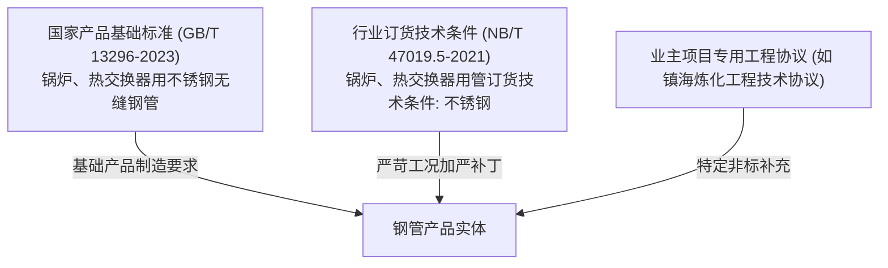

# 工业质保书多标准引用与合规比对引擎处理机制

> **专题定位**：本专题系统阐述当工业质量证明书（MTC）同时声明两份及以上技术标准（如通用产品标准 `GB/T 13296-2023` 与能源行业订货技术条件 `NB/T 47019.5-2021`）时，NormScale 比对引擎的领域建模、规则叠加、冲突仲裁与矩阵呈现规范。

---

## 1. 工业背景与标准层级定位

在石化工程、承压锅炉与核电热交换器等高端装备制造中，材料采购通常处于“双重或多重契约”之下：

- **通用产品制造标准（Base Standard）**：定义产品物理制造方式、基础外形尺寸、基准化学成分与通用力学出厂指标；
- **承压订货技术条件（Ordering Specification）**：针对压力管道防爆、耐腐蚀、抗疲劳等工况，对关键指标实施**指标加严（Tightening）、检验频次翻倍（Frequency Upgrade）与选做项强制化（Mandatory Conversion）**；
- **工程订货协议（Engineering Contract）**：补充包装支数、单管长度、指定交货表面粗糙度与第三方监检要求。

---

## 2. GB/T 13296 与 NB/T 47019.5（S32168 牌号）逐条款对比

| 检验项目 | GB/T 13296-2023 | NB/T 47019.5-2021 | 差异属性与引擎仲裁逻辑 |
|---|---|---|---|
| **断后伸长率 A** | $\ge 35.0\%$ | **$\ge 40.0\%$** | **重大加严**：订货标准将塑性储备门槛提高 5%。引擎合成门槛必须取 $\ge 40.0\%$ |
| **抗拉强度 Rm** | $\ge 520\text{ MPa}$ | Ⅰ/Ⅱ级：$\ge 520\text{ MPa}$；**TⅠ级：$520 \sim 730\text{ MPa}$** | **增加上限约束**：防止过度加工硬化脆性 |
| **屈服强度 Rp0.2** | $\ge 205\text{ MPa}$ | $\ge 205\text{ MPa}$ | 两者一致 |
| **化学成分 C、Si、Mn、P、S、Ni、Cr、Ti** | C $\le 0.08$, P $\le 0.035$, S $\le 0.015$ | 熔炼分析相同；**附录 A 增设优级标准**（S $\le 0.005\%$, P $\le 0.030\%$） | 默认一致；若合同指定优级，激活严苛门槛 |
| **晶间腐蚀试验** | 合同协商项（选做） | **规定的强制检验项目（MANDATORY）**，每批 2 根必做 GB/T 4334 方法 E | **等级升级**：由选做升级为强制项，未检即判缺失 |
| **无损检测 (超声探伤 UT)** | 逐根无损检验 | 逐根超声，对比样管人工缺陷锁定在 **U2 级** | 规范级别锁定 |
| **致密性 / 替代涡流** | 逐根水压或常规涡流（E3H） | 逐根水压（最高 20MPa 稳压 10s）；外径 $>25\text{mm}$ 替代涡流提升至 **E2H 级** | **重大加严**：涡流验收等级由 E3H 提高至 E2H |
| **硬度试验** | 壁厚 $\ge 1.7\text{mm}$ 时考核 $\le 200\text{ HV1}$；$<1.7\text{mm}$ 免检 | 壁厚 $\ge 1.7\text{mm}$ 时考核 $\le 200\text{ HV}$；$<1.7\text{mm}$ 免检 | 两者一致 |

---

## 3. NormScale 多标准比对引擎架构设计

### 3.1 规则叠加与严苛者优先原则（Strict Superiority Arbitration）

当批次同时关联标准集合 $\{S_1, S_2, \dots, S_n\}$ 时，引擎执行**规则叠加切片合成器（Rule Slice Overlay Composer）**：

1. **数值下限型指标（如抗拉强度、伸长率）**：
   $$\text{Req}_{\min} = \max\left(S_1.\min, S_2.\min, \dots, S_n.\min\right)$$
2. **数值上限型指标（如有害杂质 P、S 含量）**：
   $$\text{Req}_{\max} = \min\left(S_1.\max, S_2.\max, \dots, S_n.\max\right)$$
3. **检验要求等级（Requirement Level）**：
   $$\text{MANDATORY} \succ \text{CONDITIONAL} \succ \text{OPTIONAL\_AGREED} \succ \text{EXEMPT}$$
   *任一标准将其列为强制必检项，合成后即为强制必检项。*
4. **无损探伤与质量等级**：
   $$U2 \succ U2.5 \succ U3, \quad E2H \succ E3H \succ E4H$$
   *自动匹配更高缺陷检出灵敏度。*

### 3.2 矩阵多标尺透明追溯（Dual-Ruler Traceability）

在全景合规比对矩阵中，不能粗暴地只显示一个合成后的数字，必须保障**合规可追溯性（Compliance Explainability）**：

- **单项完全合格**：
  - 实测 $A = 62.5\%$
  - 标准要求显示：$\ge 40.0\%$ [NB] / $\ge 35.0\%$ [GB]
  - 偏差量：$+22.5\%$
  - 状态：`✓ PASS (双标均合格)`
- **落入加严剪刀差区间（边界失效）**：
  - 假设实测 $A = 38.0\%$
  - 状态：`✗ FAIL (未达标)`
  - 判定依据显示：`满足通用国标 GB/T 13296 (≥35%)，但不满足行业订货标准 NB/T 47019.5 (≥40%)，按就高严苛原则判定不合格`
  - *这为工程质量工程师提供了最关键的责任边界判定依据！*

---

## 4. 实施路径建议

1. **规则库层（Rule Store）**：已支持在 `data/standards/` 下并行维护 `GB_T_13296_2023` 与 `NB_T_47019_5_2021` 独立标准切片；
2. **切片合成层（Slice Composer）**：在 `ComplianceEngine` 中引入 `composeMultiStandardSlices(slices: SpecificationSlice[]): CompositeSlice`；
3. **前端工作台呈现（UI Layer）**：在全景合规比对矩阵的“执行标准要求”列，支持悬浮或紧凑展示多标准各自的要求明细标签。
