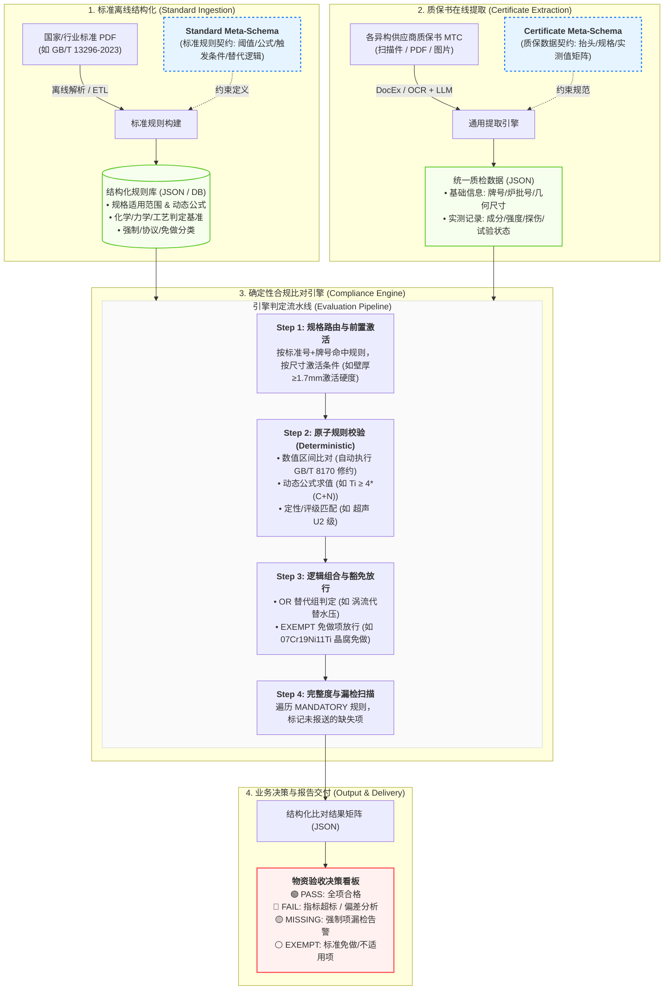
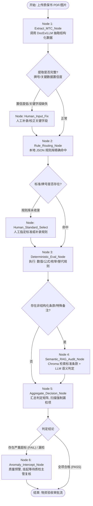

# Conversation 224de3d4

**Date**: August 21, 2026 at 09:17 AM
**Turns**: 10
**Source**: [Gemini Chat](https://gemini.google.com/u/1/app/224de3d43e6c1152?pageId=none)

---

## Turn 1: 根据你已有的信息，你了解我以前与你讨论过的DocEx项目进展到什么程度了吗

### 🤖 Gemini

根据我们之前的记录与讨论，**DocEx 项目已经完成了从核心开发到成功上线生产环境的全流程，并正在进行深度的工程化与业务扩展**。

### 1. 部署与线上运维（已完成上线）

- **生产部署**：项目已在生产服务器上稳定运行，采用 PM2 进行进程守护与状态监控，并通过 Nginx 进行反向代理与路由分发。
- **CI/CD 自动化流水线**：配置并跑通了基于 GitHub Actions 的自动化构建与部署，优化了打包模式，解决了部署过程中的权限与目录配置问题。

### 2. 配置管理重构（近期演进）

- **动静分离配置架构**：重构了配置管理方式，将敏感的基础环境变量保留在 `.env` 中，同时将 LLM 模型参数、提示词及多维表格等业务配置迁移至运行时可动态调整的 `config.json` 中，提升了配置灵活性与免重启维护能力。

### 3. UI/UX 界面升级（已完成）

- **宽屏双列布局**：完成了 UI/UX 的重大重构，采用了更适配专业操作流程的宽屏双列视图，提升了大屏展示与多任务处理时的交互体验。

### 4. 生产级可观测性（已落地）

- **全链路结构化日志**：集成了基于 **Pino** 与 **AsyncLocalStorage** 的日志与追踪体系，实现了请求上下文透传与全链路链路追踪，具备生产级的可观测性与排障能力。

### 5. 业务落地与场景拓展（推进中）

- **多部门业务赋能**：梳理并沉淀了完整的项目上线与推广经验，重点针对安环部（EHS）**和**人力资源部（HR）等业务线，拓展并落地了 4 个具体的文档处理与智能化应用场景。
想深入讨论 config.json 动态加载方案或安环/人资落地场景的具体细节吗？是

## Turn 2: you mean PostgreSQL这一个数据库就同时支持存储JSONB（和JSON的区别是？）和向量语义吗？这个技术栈我不太熟悉，可能需要重新入门，有其它可选的技术栈吗？

### 🤖 Gemini

根据我们之前的记录与讨论，**DocEx 项目已经完成了从核心开发到成功上线生产环境的全流程，并正在进行深度的工程化与业务扩展**。

### 1. 部署与线上运维（已完成上线）

- **生产部署**：项目已在生产服务器上稳定运行，采用 PM2 进行进程守护与状态监控，并通过 Nginx 进行反向代理与路由分发。
- **CI/CD 自动化流水线**：配置并跑通了基于 GitHub Actions 的自动化构建与部署，优化了打包模式，解决了部署过程中的权限与目录配置问题。

### 2. 配置管理重构（近期演进）

- **动静分离配置架构**：重构了配置管理方式，将敏感的基础环境变量保留在 `.env` 中，同时将 LLM 模型参数、提示词及多维表格等业务配置迁移至运行时可动态调整的 `config.json` 中，提升了配置灵活性与免重启维护能力。

### 3. UI/UX 界面升级（已完成）

- **宽屏双列布局**：完成了 UI/UX 的重大重构，采用了更适配专业操作流程的宽屏双列视图，提升了大屏展示与多任务处理时的交互体验。

### 4. 生产级可观测性（已落地）

- **全链路结构化日志**：集成了基于 **Pino** 与 **AsyncLocalStorage** 的日志与追踪体系，实现了请求上下文透传与全链路链路追踪，具备生产级的可观测性与排障能力。

### 5. 业务落地与场景拓展（推进中）

- **多部门业务赋能**：梳理并沉淀了完整的项目上线与推广经验，重点针对安环部（EHS）**和**人力资源部（HR）等业务线，拓展并落地了 4 个具体的文档处理与智能化应用场景。
想深入讨论 config.json 动态加载方案或安环/人资落地场景的具体细节吗？是

## Turn 3: 接下来有一个与文档提取相关的新需求，但我不确定是否应该用当前这个项目来承载。 物资供应部门在采购时，会收到各式各样的质量证明书，其中包含产品的基本信息、材质的质量执行标准\(如GB/T13296\-2023\)、根据执行标准列出的各项质量指标； 以一种换热管的质量证书举例，质量证明书中除上述内容还包含材料的化学成分，具体到每种元素的规定值和实际值，拉伸试验，硬度、晶粒度等测试结果。 难点在于各供应商提供的质量证明书格式不一、形式不一、能提供的字段不统一，不同类型的产品对应的标准不统一等等。 需求内容是，从质量证明书中提取这些质量指标，并与其对应的执行标准内容进行比对，检验质量证明书是否符合执行标准的要求。 我不确定的原因是，我发现这个需求与现有的DocEx的不同在于，它不是只是对某个文档进行一次提取或总结工作就结束的单次会话工作；而是需要根据一份或多份质保书文档，及其相关的执行标准文档都进行提取，并将跨文档的提取结果进行比对后得出结论。这与现有的DocEx可以说是不同的工作流，或者说DocEx能完成的只是其中的一环。并且考虑到各类质量执行标准，类型繁多，内容庞大，如果每次执行时才将这些执行标准解析，然后进行比对的话，可能每次都会耗费巨量的时间和算力；是否先应该基于这些标准，提前进行解析并建立RAG，然后到实际执行比对任务时，只对质量证明书进行实时解析，并通过RAG进行向量化的检索和比对？要完成这样的工作流，是否应该另起一个专用项目，并使用LangChain或LangGraph搭建一个具有针对性的Agent工作流？

### 🤖 Gemini

你的直觉非常敏锐，且抓住了这个业务场景中最核心的两个痛点：**工作流的本质差异**以及**标准文档高频比对的算力/准确度瓶颈**。
针对你的疑问，结论是：**不建议将这个需求直接揉进现有的 DocEx 主干流程中，而应该建立一个独立的专用服务（或子系统），并采用“离线结构化规则库 + 确定性比对引擎 + LangGraph 有状态编排”的架构方案。**

### 一、 为什么这个需求不适合由通用 DocEx 承载？

| 维度 | 现有的 DocEx | 质保书合规检验（新需求） |
| --- | --- | --- |
| 业务本质 | 通用内容抽取与结构化输出（单向 Pipeline） | 工业级质检与规则校验（闭环决策系统） |
| 会话状态 | 单文档/无状态或单次会话 | 强状态流（质保书提取 → 标准匹配 → 阈值校验 → 偏差告警） |
| 准确度要求 | 允许一定的语义宽容度 | 零容错（化学成分超标 0.01% 或抗拉强度差 5MPa 属于质量事故） |
| 数据源交互 | 单一输入文档 | 动态关联输入（质保书）与静态基准（多版本国家/行业标准） |
**合理的系统边界**：

- **DocEx 的角色**：作为底层的**通用文档抽取基础设施（Microservice）**，负责把不同版式、扫描件、PDF 的质保书转为标准化的 JSON 数据（牌号、炉号、各项实测值）。
- **新项目/新模块的角色**：作为**物料合规检验引擎（Quality Compliance Agent）**，负责标准库管理、牌号映射、公差比对、生成质检差异矩阵与异常阻断。

### 二、 标准库处理方案：为什么“纯向量 RAG”会踩大坑？
你敏锐地意识到“每次实时解析庞大标准文档”不可行，提出了**提前解析建 RAG** 的想法。这个方向完全正确，但需要特别注意：**对于质量执行标准，绝对不能仅依赖“向量化语义 RAG”。**

#### 1. 纯向量 RAG 在质保书比对中的致命缺陷

- **数值敏感性差**：Embedding 模型对数字区间不敏感。比如标准要求 $C \le 0.08\%$，质保书是 $0.09\%$，向量模型依然会认为两句话“极其相似”，LLM 在长上下文比对时极易出现幻觉。
- **表格条件嵌套复杂**：国家标准（如 `GB/T 13296-2023`）中的指标往往挂钩前置条件（例如：*“当外径 ≤76mm 且壁厚 ≤2.0mm 时，屈服强度 Rp0.2​≥205MPa；其余尺寸为…”*），纯文本切 Chunk 检索会破坏表格前置条件的逻辑关联。

#### 2. 推荐方案：“离线结构化规则库”为主 + “语义 RAG”为辅

```
┌────────────────────────────────────────────────────────┐
│                   国家/行业标准 (GB/T / ASTM)           │
└───────────┬────────────────────────────────┬───────────┘
            │ 离线结构化 ETL                  │ 离线向量化
            ▼                                ▼
┌───────────────────────┐        ┌───────────────────────┐
│ 结构化规则库 (JSON/DB) │        │ 文本条款向量库 (Vector)│
│ - 牌号: 06Cr19Ni10    │        │ - 表面质量检验要求    │
│ - C: [0, 0.08]        │        │ - 晶间腐蚀试验方法    │
│ - Rm: [520, +∞)       │        │ - 热处理及交付状态说明│
└───────────┬───────────┘        └───────────┬───────────┘
            │ 毫秒级查表                      │ 语义召回
            └───────────────┬────────────────┘
                            ▼
               ┌────────────────────────┐
               │   混合比对与检验引擎   │
               └────────────────────────┘

```

1. **核心理化指标（结构化存储）**： 提前将常用标准的“牌号-化学成分表”、“牌号-力学性能表”解析为结构化的 JSON 或关系型数据表（包含下限、上限、前置规格条件等）。比对时直接执行**代码级逻辑判定（Python/TS 规则运算）**，速度仅需几毫秒，且 **100% 确定、零幻觉**。
2. **文本型条款（向量 RAG）**： 对于标准的文字描述类要求（如“压扁试验无裂缝”、“超声波探伤合格级别”、“酸洗钝化要求”），使用向量 RAG 检索对应条款，交由 LLM 进行语义合规匹配。

### 三、 为什么推荐使用 LangGraph 搭建专用工作流？
该场景不是简单的单轮 Prompt 问答，而是一个**具有分支判断、循环校验、人机协同（Human-in-the-Loop）的有向状态图**，LangGraph 是目前最契合的技术栈。

#### LangGraph 工作流状态机设计：

```
[开始: 质保书输入]
       │
       ▼
 1. Extract_Certificate_Node (调用 DocEx/OCR，提取物料、标准号、牌号、实测值)
       │
       ▼
 2. Resolve_Standard_Node (标准消歧与版本对齐，如 GB/T 13296-2023)
       ├──────────────【未找到匹配标准】─────────────┐
       │                                             ▼
       ▼                                  [Human_Review: 人工补录标准]
 3. Rule_Engine_Check_Node (确定性数值范围比对: 元素含量、拉伸、硬度)
       │
       ▼
 4. Semantic_Clauses_Audit_Node (RAG 检索文本条款，LLM 比对晶粒度/无损探伤等)
       │
       ▼
 5. Generate_Audit_Report_Node (生成对比矩阵，标红超标/漏检项，给出判定结论)
       │
       ▼
[结束: 输出质检单]

```

- **状态持久化与回溯**：如果质保书图片模糊导致某个元素提取缺失（如缺少 $S$ 含量），流程可以中断并挂起，通知供应部人员手动确认后再继续流转。
- **分步容错**：提取、标准解析、数值校验解耦，任意一步出错均可独立重试或降级处理。

### 四、 落地推进建议

1. **第一阶段（小切口验证规则库 + 确定性比对）**：
  - 挑选采购量最大的 1~2 个标准（如换热管常用的 `GB/T 13296` 或 `GB/T 24593`），人工或借助脚本将其指标提取并固化为标准 JSON 规则模板。
  - 写一个 Python 校验脚本，验证“结构化提取数据 $\to$ 规则库区间判定”的准确率。
2. **第二阶段（接入 DocEx 提取能力并用 LangGraph 串联）**：
  - 新建独立项目，通过 API 调用现有 DocEx（或多模态大模型）进行前端 OCR 结构化提取。
  - 使用 LangGraph 组装提取、规则判定、文本 RAG 条款核对全流程。
3. **第三阶段（交互界面与异常反馈）**：
  - 搭建专用的**质检对比视图**（左侧显示原始质保书高亮框，右侧显示红/黄/绿灯的指标对比矩阵表），方便物资供应部门一键审查。

## Turn 4: 我想先考虑这个合规比对引擎的设计。 如何定义这个引擎，它需要涵盖哪些功能？ 请帮我设计一套用于承载质量执行标准（如化学成分、力学性能区间）和质保书提取结果的结构化 JSON Schema 定义。 你先立即做一个简短的回复，接下来我再上传一份《GB 13296\-2023》，以便进行举例分析。

### 🤖 Gemini

### 一、 合规比对引擎定义与核心功能
**引擎定义**：以**确定性规则判别为主、LLM 语义核验为辅**的双轨质检决策引擎。输入结构化的质保书数据与标准规则分片，输出字段级对比矩阵、公差偏离分析及综合合规结论。

#### 核心功能模块：

1. **规格绑定与分片解析（Spec Binder）**：根据质保书中的材料牌号、外径/壁厚尺寸、热处理交货状态，动态匹配并锁定该标准下的唯一指标分支（避免用大口径管指标校验小口径薄壁管）。
2. **确定性数值判定（Metric Evaluator）**：
  - **区间校验**：执行包含/不包含边界（$[\min, \max]$、$\ge$、$\le$）的严格数值判别。
  - **数值修约规则**：自动对接国标修约规则（如 GB/T 8170），避免因小数点精度舍入误判。
3. **定性与工艺条款审核（Semantic Auditor）**：比对非数值型检验项（如压扁试验、扩口试验、晶间腐蚀、无损探伤级别、表面钝化等）的合格判定与方法标准。
4. **质检差异矩阵与告警生成（Report Generator）**：
  - 状态标识：`PASS`（合格）、`FAIL`（超标/未达标）、`MISSING`（标准强制要求但质保书漏检）、`EXTRA`（质保书多检项）。
  - 输出结构化结果并支持可视化高亮渲染。

### 二、 核心 JSON Schema 定义

#### 1. 执行标准规则库定义 (`standard_spec_schema.json`)

```json
{
  "standard_id": "GB/T 13296-2023",
  "grade": "06Cr19Ni10",
  "unified_code": "S30408",
  "applicability": {
    "outer_diameter_max_mm": null,
    "wall_thickness_max_mm": null,
    "delivery_state": "固溶处理"
  },
  "chemical_composition": {
    "C":  { "min": 0, "max": 0.08, "unit": "%" },
    "Si": { "min": 0, "max": 1.00, "unit": "%" },
    "Mn": { "min": 0, "max": 2.00, "unit": "%" },
    "P":  { "min": 0, "max": 0.045, "unit": "%" },
    "S":  { "min": 0, "max": 0.030, "unit": "%" },
    "Ni": { "min": 8.00, "max": 11.00, "unit": "%" },
    "Cr": { "min": 18.00, "max": 20.00, "unit": "%" }
  },
  "mechanical_properties": {
    "tensile_strength_Rm_MPa": { "min": 520, "max": null, "unit": "MPa" },
    "yield_strength_Rp02_MPa": { "min": 205, "max": null, "unit": "MPa" },
    "elongation_A_percent":    { "min": 35,  "max": null, "unit": "%" },
    "hardness_HRB":            { "min": null, "max": 90, "unit": "HRB" }
  },
  "qualitative_tests": [
    {
      "test_name": "flattening_test",
      "required": true,
      "rule_description": "压扁试验两平板间距离 H 计算合格，无裂纹或裂口"
    },
    {
      "test_name": "intergranular_corrosion",
      "required": false,
      "rule_description": "按 GB/T 4334-2020 E法进行，无晶间腐蚀倾向"
    }
  ]
}

```

#### 2. 质保书提取结果定义 (`certificate_extract_schema.json`)

```json
{
  "certificate_no": "QS-202608-001",
  "supplier_name": "某特种钢管制造有限公司",
  "product_name": "锅炉、热交换器用不锈钢无缝钢管",
  "standard_claimed": "GB/T 13296-2023",
  "grade_claimed": "06Cr19Ni10",
  "heat_no": "H260815A",
  "batch_no": "B2026-03",
  "dimensions": {
    "outer_diameter_mm": 25.0,
    "wall_thickness_mm": 2.0,
    "length_mm": 6000
  },
  "delivery_state": "固溶酸洗",
  "chemical_composition_actual": {
    "C": 0.042,
    "Si": 0.55,
    "Mn": 1.20,
    "P": 0.028,
    "S": 0.008,
    "Ni": 8.15,
    "Cr": 18.30
  },
  "mechanical_properties_actual": {
    "tensile_strength_Rm_MPa": 565,
    "yield_strength_Rp02_MPa": 230,
    "elongation_A_percent": 42.5,
    "hardness_HRB": 82
  },
  "qualitative_tests_actual": [
    {
      "test_name": "flattening_test",
      "result": "合格",
      "reported": true
    },
    {
      "test_name": "hydraulic_test",
      "result": "合格 (10MPa, 稳压10s 无渗漏)",
      "reported": true
    }
  ]
}

```
请随时上传或粘贴《GB 13296-2023》的具体内容/截图/表格片段，我们以换热管真实标准的细节（如不同牌号的化学元素细则、力学性能尺寸分段条件）来实战校验并完善这套规则结构。

## Turn 5: 📎 GB 13296\-2023\.pdf 这种标准文件所涉及的专业是我不熟悉的领域，请先带我解读并理解这种标准文档是如何被应用到生产或采购中的。然后我们再来按schema对其进行抽象和拆解。

### 🤖 Gemini

国家标准（如这份《GB/T 13296-2023》）在工业制造业中不仅是一份技术说明书，更是**采购合同中具备法律效力的技术协议基准**。

### 一、 工业现实：标准如何在“采购-生产-质检验收”中流转？

```
[物资采购部门] ── 下发采购合同 (指定 GB/T 13296-2023 + 牌号规格) ──► [钢管制造厂]
                                                                        │
                                                                   生产与实验室检测
                                                                        │
[物资验收入库] ◄── 随货提供《产品质量证明书》(MTC) + 钢管实物 ─────────────┘
      │
 (执行比对引擎)
      ├─ 1. 规格路由：根据牌号/尺寸确定适用规则分支
      ├─ 2. 理化核验：实测值 vs 标准区间 (一票否决)
      └─ 3. 缺项校验：强制检验项是否全覆盖

```

1. **采购下单（确立契约）**：
  - 采购方不会在合同里写几十项化学成分，而是直接写：`GB/T 13296-2023 06Cr19Ni10 W-C 25×2×6000`。
  - 这行代码等同于声明：“这批冷拔换热管必须 100% 满足该标准第 6、7 章的所有强制指标”。
2. **供应商生产与检测（出具质保证书 MTC）**：
  - 钢厂冶炼浇铸出一炉钢水（记录**炉号**，如 `H24081`），分批次轧制拉拔成管（记录**批号**）。
  - 钢厂质检科取样做光谱分析、拉伸机拉断测强度、做压扁/扩口、打超声波探伤，将实测数据打印成《产品质量证明书》。
3. **物资供应部门收货（合规比对与把关）**：
  - 质保证书是这批钢管的“身份证”与“体检报告”。
  - 验收工程师必须逐一核对：**质保书上的每个元素、每个力学指标是否都在国标允许的公差范围内**。如果某个元素（例如碳含量或硫含量）超标 $0.005\%$，换热管在高温高压酸性介质下可能发生爆管或晶间腐蚀，整批物料必须立即判定不合格并拒收。

### 二、 标准文档解构：计算机规则引擎视角
《GB/T 13296-2023》整篇文档可以拆解为 **4 个核心判定层级**：

```
                              ┌─────────────────────────────┐
                              │  前置路由条件 (Routing Keys)  │
                              │  牌号、制造方式、外径、壁厚 │
                              └──────────────┬──────────────┘
                                             │
      ┌──────────────────────┬───────────────┴──────────────┬──────────────────────┐
      ▼                      ▼                              ▼                      ▼
┌──────────────┐      ┌──────────────┐              ┌──────────────┐      ┌──────────────┐
│  化学成分表  │      │  力学与硬度  │              │  工艺性能    │      │  无损与探伤  │
│  (熔炼分析)  │      │ (拉伸/硬度)  │              │ (压扁/扩口)  │      │ (超声/水压)  │
└──────────────┘      └──────────────┘              └──────────────┘      └──────────────┘

```

#### 1. 前置路由条件（确定适用哪个规则分支）

- **牌号与统一数字代号**：如 `06Cr19Ni10`（代号 `S30408`）。标准共定义了 31 种牌号，牌号是第一级路由 Key。
- **制造方法**：冷拔（代号 `W-C`）或热轧（代号 `W-H`），影响壁厚公差和拉伸强度的判定阈值（如热挤压管抗拉强度允许降低 20MPa）。
- **规格尺寸**：外径 $D$、壁厚 $S$，决定是否触发某些特定试验（如壁厚 $\le 10\text{ mm}$ 才做压扁试验，壁厚 $\ge 1.7\text{ mm}$ 才做硬度试验）。

#### 2. 化学成分矩阵（绝对数值区间比对，表3）

- **常规单边/双边阈值**：如碳含量 $C \le 0.08\%$（最大值），镍含量 $Ni: 8.00\% \sim 11.00\%$（双边区间）。
- **动态关联公式（特别注意）**：部分牌号并非固定值，例如含钛牌号 `06Cr18Ni11Ti`（序号22），要求钛含量 $Ti \ge 5 \times (C + N) \sim 0.70\%$。规则引擎必须支持**跨字段的动态公式计算**。
- **合并元素上限约束**：例如表3注“允许含有 $\le 0.50\% Ni$、$\le 0.20\% Cu$，但 $Ni + Cu \le 0.50\%$”。

#### 3. 力学性能与物理状态（表4、表5）

- **常温拉伸三大件**：
  - 抗拉强度 $R_m$（$\ge 520\text{ MPa}$）
  - 屈服强度/规定塑性延伸强度 $R_{p0.2}$（$\ge 205\text{ MPa}$）
  - 断后伸长率 $A$（$\ge 35\%$）
- **热处理制度**：固溶温度区间（如 $1010^\circ\text{C} \sim 1150^\circ\text{C}$，急冷）。
- **硬度指标**：提供三种硬度单位（洛氏 HRB、布氏 HBW、维氏 HV），质保书通常只测其中一种，只要满足对应标尺的上限即可（如普通奥氏体钢 $\text{HRB} \le 90$）。

#### 4. 工艺与无损检验（定性逻辑 + 替代性规则）

- **压扁试验（7.6.1）**：两平板间距 $H$ 按公式计算 $H = \frac{(1+\alpha)S}{\alpha + S/D}$（奥氏体 $\alpha=0.09$）。
- **承压检验（7.5 水压 vs 涡流）**：
  - 标准要求逐根做水压试验（计算公式 $P = \frac{2SR}{D}$）。
  - **替代逻辑**：标准明确规定“供方可用涡流检测代替液压试验，验收等级应符合 GB/T 7735-2016 中 E3H 级”。规则引擎必须识别这种“或”关系。
- **无损检测（7.9）**：强制要求逐根进行超声波检测，验收等级必须达到 `GB/T 5777-2019 U2 级`。
- **晶间腐蚀（7.7）**：特定牌号强制要求做 `GB/T 4334-2020 E法`，部分牌号免做。

### 三、 规则引擎设计的三大“技术暗礁”

1. **“强制项”与“协商项”的边界**：
  - 某些试验是**强制项**（化学成分、拉伸、压扁、超声）。
  - 某些是**选做/协议项**（如 7.4.3 高温拉伸、7.3.2 稳定化热处理，标准注有“根据需方要求，经供需双方协商，并在合同中注明”）。如果质保书没有高温拉伸，不能直接判“不合格”，而是标记为“未声明/非强制”。
2. **交货壁厚类型（最小壁厚 vs 公称壁厚）**：
  - 标准第 6.1.1 条说明，钢管默认按**公称外径 + 最小壁厚**交货（公差下偏差为 0，只能偏厚不能偏薄）；若合同约定公称壁厚，公差则是对称的（如 $\pm 10\%$）。这会直接影响尺寸合格性的判别逻辑。
3. **指标修约规则（GB/T 8170）**：
  - 例如标准规定碳含量 $\le 0.08\%$。若质保书显示 $0.082\%$，根据常规保留位数修约后为 $0.08\%$（合格），但若显示 $0.086\%$ 修约后为 $0.09\%$（超标）。数值判定模块必须支持配置修约规则。

### 四、 接下来推进计划
理解了业务逻辑与标准的内在结构后，我们可以将这份 PDF 彻底转化为机器可读的规则库：

1. **以代表性牌号为例（如通用型 S30408 / 06Cr19Ni10 和含动态公式的 S32168 / 06Cr18Ni11Ti）**：把 PDF 里的表3、表4、表5以及第7章各项文本要求，提炼为一份完整的标准规则 JSON。
2. **模拟一份实际可能收到的质保证书（含部分超标和漏检项）**，输入到比对引擎的数据结构中，进行逐项校验演示。

## Turn 6: wait，也就是说上一轮回答中给出的schema只适用于钢管（准确地说是锅炉、热交换器用不锈钢无缝钢管）的合规比对吧。 如果要向上抽象一层使其能兼容更多适用于不同种类材料的标准呢？

### 🤖 Gemini

你的感知非常准确。上一轮给出的 Schema 是针对“钢管”这一具体品类的**特化模型（Concrete Model）**。如果直接把它写死在系统中，当遇到钢板、锻件、紧固件、非铁金属（如铜合金/钛合金），甚至非金属材料（如橡胶密封件、涂层）时，系统的数据结构就会彻底崩溃。
要构建一个能够支撑全品类物料质量合规比对的系统，必须将标准与质保书抽象为**元数据驱动的通用材料规则模型（General Materials Compliance Meta-Schema）**。

### 一、 向上抽象的核心：解构材料标准的共性
无论什么材料（金属、塑料、复合材料、化工原料），其标准体系与质检逻辑在底层都可以抽象为 **4 个核心元模型**：

```
                      ┌─────────────────────────────────┐
                      │    1. 适用条件 (Scope Matcher)   │
                      │  牌号、形态、交货状态、规格边界  │
                      └────────────────┬────────────────┘
                                       │ 命中规则分片
                                       ▼
                      ┌─────────────────────────────────┐
                      │    2. 通用指标项 (Rule Items)   │
                      └────────────────┬────────────────┘
                                       │
         ┌─────────────────────────────┼─────────────────────────────┐
         ▼                             ▼                             ▼
  【定量数值型】                 【动态公式型】                 【定性/文本/评级型】
  (Numeric Range)               (Dynamic Expression)          (Qualitative/Enum)
  $C \le 0.08\%$                 $Ti \ge 5 \times (C+N)$       无损探伤 $\ge \text{U2}$ 级
  $R_m \ge 520\text{ MPa}$       压扁 $H = f(S, D)$            表面无裂纹/夹渣
         │                             │                             │
         └─────────────────────────────┼─────────────────────────────┘
                                       │
                      ┌────────────────┴────────────────┐
                      │   3. 约束与逻辑 (Constraints)   │
                      │  - 强制项 / 协议项 / 触发项     │
                      │  - "与(AND)" / "或(OR)替代" 逻辑│
                      └─────────────────────────────────┘

```

1. **品类与形态解耦**：不再固定写 `outer_diameter`（外径），而是抽象为通用几何形态（`form: pipe | plate | bar | wire | powder`）及通用尺寸参数字典（`dimensions: { thickness, diameter, width, length }`）。
2. **检测类别泛化**：不再写死化学、力学字段，而是抽象为**可扩展的检测维度（Dimension Categories）**，如成分分析（`chemical`）、力学性能（`mechanical`）、工艺性能（`process`）、金相组织（`metallographic`）、环境耐候/腐蚀（`corrosion`）、无损检测（`ndt`）、几何公差（`geometric`）等。
3. **判定原子化（Rule Primitives）**：任何检验项本质上只有三种判定方式：
  - **区间比较**（`min`, `max`, `unit`, `tolerance`, `rounding`）
  - **公式计算**（`formula`, `dependencies`）
  - **枚举/定性匹配**（`expected_values`, `semantic_regex`, `standard_method`）

### 二、 通用标准规则库 Schema 定义 (`standard_meta_schema.json`)
这套 Schema 采用“规则集（RuleSet）+ 触发条件（Conditions）+ 规则原子（Rule Atom）”的设计，可承载任何工业材料标准。

```json
{
  "$schema": "https://json-schema.org/draft/2020-12/schema",
  "title": "UniversalMaterialStandardRuleSet",
  "type": "object",
  "properties": {
    "standard_meta": {
      "standard_id": "GB/T 13296-2023",
      "name": "锅炉、热交换器用不锈钢无缝钢管",
      "version": "2023",
      "industry_type": "metallurgy_ferrous",
      "material_class": "stainless_steel"
    },
    "grade_rules": [
      {
        "grade_identifier": {
          "primary_grade": "06Cr19Ni10",
          "aliases": ["S30408", "SUS304", "TP304"],
          "standard_code": "S30408"
        },
        "applicability_scope": {
          "material_form": "tube_seamless",
          "manufacturing_process": ["cold_drawn", "hot_rolled"],
          "delivery_state": ["solution_annealed"],
          "dimension_conditions": [
            { "field": "dimensions.wall_thickness_mm", "operator": "<=", "value": 10.0 }
          ]
        },
        "evaluation_rules": [
          {
            "rule_id": "CHEM_C",
            "category": "chemical",
            "property_name": "C",
            "display_name": "碳含量",
            "rule_type": "numeric_range",
            "requirement_level": "MANDATORY",
            "criteria": {
              "min": null,
              "max": 0.08,
              "unit": "%",
              "rounding_precision": 2
            }
          },
          {
            "rule_id": "CHEM_TI_DYNAMIC",
            "category": "chemical",
            "property_name": "Ti",
            "display_name": "钛含量",
            "rule_type": "dynamic_expression",
            "requirement_level": "MANDATORY",
            "criteria": {
              "formula": "5 * (ctx.chemical.C + ctx.chemical.N)",
              "min_from_formula": true,
              "max": 0.70,
              "unit": "%"
            }
          },
          {
            "rule_id": "MECH_RM",
            "category": "mechanical",
            "property_name": "tensile_strength",
            "display_name": "抗拉强度(Rm)",
            "rule_type": "numeric_range",
            "requirement_level": "MANDATORY",
            "criteria": {
              "min": 520,
              "max": null,
              "unit": "MPa",
              "rounding_precision": 0
            }
          },
          {
            "rule_id": "MECH_HARDNESS_GROUP",
            "category": "mechanical",
            "property_name": "hardness",
            "display_name": "硬度试验",
            "rule_type": "or_choice_group",
            "requirement_level": "CONDITIONAL",
            "condition_trigger": "ctx.dimensions.wall_thickness_mm >= 1.7",
            "options": [
              { "sub_property": "HRB", "rule_type": "numeric_range", "criteria": { "max": 90, "unit": "HRB" } },
              { "sub_property": "HBW", "rule_type": "numeric_range", "criteria": { "max": 192, "unit": "HBW" } },
              { "sub_property": "HV",  "rule_type": "numeric_range", "criteria": { "max": 200, "unit": "HV" } }
            ]
          },
          {
            "rule_id": "NDT_PRESSURE_INTEGRITY",
            "category": "ndt",
            "property_name": "pressure_tightness",
            "display_name": "承压/致密性检验",
            "rule_type": "alternative_group",
            "requirement_level": "MANDATORY",
            "group_logic": "AT_LEAST_ONE_PASS",
            "candidates": [
              {
                "candidate_id": "hydraulic_test",
                "display_name": "液压试验",
                "criteria_description": "无渗漏，试验压力满足公式 2SR/D 计算值且稳压 >= 10s"
              },
              {
                "candidate_id": "eddy_current_test",
                "display_name": "涡流检测",
                "criteria_standard": "GB/T 7735-2016",
                "acceptance_level": "E3H"
              }
            ]
          },
          {
            "rule_id": "NDT_ULTRASONIC",
            "category": "ndt",
            "property_name": "ultrasonic_test",
            "display_name": "超声检测",
            "rule_type": "qualitative_enum",
            "requirement_level": "MANDATORY",
            "criteria": {
              "test_standard": "GB/T 5777-2019",
              "acceptance_level": "U2"
            }
          }
        ]
      }
    ]
  }
}

```

### 三、 通用质保书提取结果 Schema 定义 (`certificate_meta_schema.json`)
提取端（DocEx / OCR + LLM）不再输出零散的特化字段，而是统一输出为扁平化或键值化（Key-Value Metric）的通用实体结构：

```json
{
  "$schema": "https://json-schema.org/draft/2020-12/schema",
  "title": "UniversalMaterialInspectionCertificate",
  "type": "object",
  "properties": {
    "header": {
      "certificate_no": "QS-202608-001",
      "supplier_name": "浙江某特种合金材料股份有限公司",
      "customer_name": "某装备制造集团",
      "issue_date": "2026-08-15",
      "material_product_name": "锅炉、热交换器用不锈钢无缝钢管",
      "declared_standard": "GB/T 13296-2023",
      "declared_grade": "06Cr19Ni10",
      "heat_number": "H260815A",
      "batch_lot_number": "B2026-03",
      "material_form": "tube_seamless",
      "manufacturing_process": "cold_drawn",
      "delivery_state": "固溶酸洗",
      "dimensions": {
        "outer_diameter_mm": 25.0,
        "wall_thickness_mm": 2.0,
        "length_mm": 6000
      },
      "quantity": {
        "pieces": 120,
        "weight_kg": 1380.5
      }
    },
    "test_records": [
      {
        "category": "chemical",
        "property_key": "C",
        "sample_type": "melt_analysis",
        "measured_value_num": 0.042,
        "measured_value_raw": "0.042%",
        "unit": "%",
        "test_method_standard": "GB/T 11170"
      },
      {
        "category": "chemical",
        "property_key": "Ni",
        "sample_type": "melt_analysis",
        "measured_value_num": 8.15,
        "measured_value_raw": "8.15%",
        "unit": "%",
        "test_method_standard": "GB/T 11170"
      },
      {
        "category": "mechanical",
        "property_key": "tensile_strength",
        "test_temperature_c": 20,
        "sample_direction": "longitudinal",
        "measured_value_num": 565,
        "measured_value_raw": "565 MPa",
        "unit": "MPa",
        "test_method_standard": "GB/T 228.1"
      },
      {
        "category": "mechanical",
        "property_key": "hardness",
        "sub_property": "HRB",
        "measured_value_num": 82,
        "measured_value_raw": "82 HRB",
        "unit": "HRB",
        "test_method_standard": "GB/T 230.1"
      },
      {
        "category": "ndt",
        "property_key": "eddy_current_test",
        "qualitative_result": "PASS",
        "measured_level_claimed": "E3H",
        "test_method_standard": "GB/T 7735-2016",
        "conclusion_text": "全长涡流探伤合格，符合E3H级要求"
      },
      {
        "category": "ndt",
        "property_key": "ultrasonic_test",
        "qualitative_result": "PASS",
        "measured_level_claimed": "U2",
        "test_method_standard": "GB/T 5777-2019",
        "conclusion_text": "纵向/横向超声波探伤合格，符合U2级"
      }
    ]
  }
}

```

### 四、 通用比对引擎执行逻辑矩阵
通过这套 Meta-Schema，比对引擎的代码逻辑彻底与“钢管/钢板/橡胶”业务解耦。执行引擎只需遵循一个通用的**判定协议管道（Evaluation Pipeline）**：

```
[输入: 通用质保书 JSON]
       │
       ▼
 1. 【路由匹配】: 按 standard_id + grade + material_form 筛选出标准库中命中的 grade_rule
       │
       ▼
 2. 【规则展开】: 解析 condition_trigger（例如壁厚 >= 1.7mm 才激活硬度规则，否则自动跳过）
       │
       ▼
 3. 【执行原子校验器】:
    ├─ Numeric Evaluator: min <= measured_val <= max (结合 rounding_precision 修约)
    ├─ Formula Evaluator: 动态注入 ctx 变量并 eval 计算表达式（如 Ti >= 5*(C+N)）
    ├─ Enum/Qualitative Evaluator: 验收等级 / 探伤标准匹配
    └─ Logic Group Evaluator: 处理 OR (替代项) 与 AND (组合项)
       │
       ▼
 4. 【漏检项扫描 (Missing Check)】:
    扫描 grade_rules 中所有 requirement_level == "MANDATORY" 的规则，
    若质保书 test_records 中未找到对应项，判定为 MISSING_MANDATORY_ITEM
       │
       ▼
[输出: 结构化质检评估报告矩阵]

```

### 五、 这种抽象带来的收益

1. **零代码扩展新材料**：物资供应部明天要采购“钛合金板材”或“法兰锻件”，只需通过 Admin 界面或解析脚本录入一份符合 `standard_meta_schema` 的规则 JSON，**比对引擎的核心代码一行都不用改**。
2. **多标准版本兼容**：同一种牌号在 `GB/T 13296-2013` 和 `GB/T 13296-2023` 中硫含量上限不同（2013 版是 0.030%，2023 版改为 0.015%），只需在 `standard_meta` 中指定版本，引擎会自动根据合同声称的标准版本进行匹配。

## Turn 7: 📎 GB 13296\-2023\.pdf 那么我们能尝试用这份Schema来拆解GB 13296\-2023吗

### 🤖 Gemini

基于通用材料规则元模型（Universal Meta-Schema），对《GB/T 13296-2023》进行完整拆解与结构化映射。

### 一、 顶层元数据与公用公差规则（标准全局配置）
标准第 4、6 章定义了制造方式、交货状态与几何尺寸公差表。我们将其抽象为标准的全局公共规则池：

```json
{
  "$schema": "https://json-schema.org/draft/2020-12/schema",
  "standard_meta": {
    "standard_id": "GB/T 13296-2023",
    "standard_name": "锅炉、热交换器用不锈钢无缝钢管",
    "status": "CURRENT",
    "material_category": "ferrous_pipe",
    "applies_to_forms": ["tube_seamless"]
  },
  "global_dimension_tolerance_tables": {
    "cold_drawn_outer_diameter": [
      { "d_min": 0,   "d_max": 25,  "tolerance_plus": 0.10, "tolerance_minus": -0.10, "unit": "mm" },
      { "d_min": 25,  "d_max": 40,  "tolerance_plus": 0.15, "tolerance_minus": -0.15, "unit": "mm" },
      { "d_min": 40,  "d_max": 50,  "tolerance_plus": 0.20, "tolerance_minus": -0.20, "unit": "mm" },
      { "d_min": 50,  "d_max": 65,  "tolerance_plus": 0.25, "tolerance_minus": -0.25, "unit": "mm" },
      { "d_min": 65,  "d_max": 75,  "tolerance_plus": 0.30, "tolerance_minus": -0.30, "unit": "mm" },
      { "d_min": 75,  "d_max": 100, "tolerance_plus": 0.38, "tolerance_minus": -0.38, "unit": "mm" },
      { "d_min": 100, "d_max": 159, "tolerance_plus": 0.38, "tolerance_minus": -0.64, "unit": "mm" },
      { "d_min": 159, "d_max": null,"tolerance_ratio_plus": 0.005, "tolerance_ratio_minus": -0.005 }
    ],
    "cold_drawn_min_wall_thickness": [
      { "d_max": 38,   "tolerance_ratio_plus": 0.20, "tolerance_ratio_minus": 0.0 },
      { "d_min": 38.01,"tolerance_ratio_plus": 0.22, "tolerance_ratio_minus": 0.0 }
    ]
  }
}

```
(注：对应 PDF 第 3 页表 1 公称外径与最小壁厚允许偏差)

### 二、 典型牌号规则切片拆解
以两个最具代表性的牌号为例：

1. **06Cr19Ni10 (S30408)**：工业最通用的常规奥氏体钢，包含常规成分、硬度三选一、压扁/扩口、晶间腐蚀强制项。
2. **07Cr19Ni11Ti (S32169)**：含稳定化元素牌号，包含**跨元素动态计算公式**、晶粒度级别与腐蚀免做判定。

```json
{
  "grade_rules": [
    {
      "grade_info": {
        "primary_grade": "06Cr19Ni10",
        "unified_code": "S30408",
        "structure_type": "austenitic",
        "aliases": ["SUS304", "TP304", "0Cr18Ni9"]
      },
      "evaluation_rules": [
        /* ------------------ 1. 化学成分 (表3) ------------------ */
        {
          "rule_id": "CHEM_06Cr19Ni10_C",
          "category": "chemical",
          "property_key": "C",
          "display_name": "碳含量",
          "rule_type": "numeric_range",
          "requirement_level": "MANDATORY",
          "criteria": { "min": null, "max": 0.08, "unit": "%", "rounding_decimals": 3 }
        },
        {
          "rule_id": "CHEM_06Cr19Ni10_Si",
          "category": "chemical",
          "property_key": "Si",
          "display_name": "硅含量",
          "rule_type": "numeric_range",
          "requirement_level": "MANDATORY",
          "criteria": { "min": null, "max": 1.00, "unit": "%", "rounding_decimals": 2 }
        },
        {
          "rule_id": "CHEM_06Cr19Ni10_Mn",
          "category": "chemical",
          "property_key": "Mn",
          "display_name": "锰含量",
          "rule_type": "numeric_range",
          "requirement_level": "MANDATORY",
          "criteria": { "min": null, "max": 2.00, "unit": "%", "rounding_decimals": 2 }
        },
        {
          "rule_id": "CHEM_06Cr19Ni10_P",
          "category": "chemical",
          "property_key": "P",
          "display_name": "磷含量",
          "rule_type": "numeric_range",
          "requirement_level": "MANDATORY",
          "criteria": { "min": null, "max": 0.035, "unit": "%", "rounding_decimals": 3 }
        },
        {
          "rule_id": "CHEM_06Cr19Ni10_S",
          "category": "chemical",
          "property_key": "S",
          "display_name": "硫含量",
          "rule_type": "numeric_range",
          "requirement_level": "MANDATORY",
          "criteria": { "min": null, "max": 0.015, "unit": "%", "rounding_decimals": 3 }
        },
        {
          "rule_id": "CHEM_06Cr19Ni10_Ni",
          "category": "chemical",
          "property_key": "Ni",
          "display_name": "镍含量",
          "rule_type": "numeric_range",
          "requirement_level": "MANDATORY",
          "criteria": { "min": 8.00, "max": 11.00, "unit": "%", "rounding_decimals": 2 }
        },
        {
          "rule_id": "CHEM_06Cr19Ni10_Cr",
          "category": "chemical",
          "property_key": "Cr",
          "display_name": "铬含量",
          "rule_type": "numeric_range",
          "requirement_level": "MANDATORY",
          "criteria": { "min": 18.00, "max": 20.00, "unit": "%", "rounding_decimals": 2 }
        },

        /* ------------------ 2. 力学性能 (表4) ------------------ */
        {
          "rule_id": "MECH_06Cr19Ni10_RM",
          "category": "mechanical",
          "property_key": "tensile_strength",
          "display_name": "抗拉强度(Rm)",
          "rule_type": "numeric_range",
          "requirement_level": "MANDATORY",
          "criteria": {
            "min": 520,
            "max": null,
            "unit": "MPa",
            "condition_adjustments": [
              {
                "when": "ctx.header.manufacturing_process == 'hot_extrusion'",
                "min_offset": -20,
                "note": "热挤压钢管抗拉强度允许降低20MPa"
              }
            ]
          }
        },
        {
          "rule_id": "MECH_06Cr19Ni10_RP02",
          "category": "mechanical",
          "property_key": "yield_strength_rp02",
          "display_name": "规定塑性延伸强度(Rp0.2)",
          "rule_type": "numeric_range",
          "requirement_level": "MANDATORY",
          "criteria": { "min": 205, "max": null, "unit": "MPa" }
        },
        {
          "rule_id": "MECH_06Cr19Ni10_A",
          "category": "mechanical",
          "property_key": "elongation_A",
          "display_name": "断后伸长率(A)",
          "rule_type": "numeric_range",
          "requirement_level": "MANDATORY",
          "criteria": { "min": 35, "max": null, "unit": "%" }
        },

        /* ------------------ 3. 硬度试验 (7.4.2 & 表5，多选一) ------------------ */
        {
          "rule_id": "MECH_06Cr19Ni10_HARDNESS",
          "category": "mechanical",
          "property_key": "hardness",
          "display_name": "硬度指标",
          "rule_type": "or_choice_group",
          "requirement_level": "OPTIONAL_AGREED",
          "trigger_condition": "ctx.header.dimensions.wall_thickness_mm >= 1.7",
          "options": [
            { "sub_key": "HRB", "rule_type": "numeric_range", "criteria": { "max": 90, "unit": "HRB" } },
            { "sub_key": "HBW", "rule_type": "numeric_range", "criteria": { "max": 192, "unit": "HBW" } },
            { "sub_key": "HV",  "rule_type": "numeric_range", "criteria": { "max": 200, "unit": "HV" } }
          ]
        },

        /* ------------------ 4. 工艺性能试验 (7.6) ------------------ */
        {
          "rule_id": "PROC_FLATTENING",
          "category": "process",
          "property_key": "flattening_test",
          "display_name": "压扁试验",
          "rule_type": "dynamic_formula_pass",
          "requirement_level": "MANDATORY",
          "trigger_condition": "ctx.header.dimensions.wall_thickness_mm <= 10.0",
          "criteria": {
            "formula_distance_H": "(1 + 0.09) * S / (0.09 + S / D)",
            "expected_visual_result": "NO_CRACKS",
            "test_standard": "GB/T 246"
          }
        },
        {
          "rule_id": "PROC_FLARING",
          "category": "process",
          "property_key": "flaring_test",
          "display_name": "扩口试验",
          "rule_type": "qualitative_and_numeric",
          "requirement_level": "MANDATORY",
          "trigger_condition": "ctx.header.dimensions.outer_diameter_mm <= 150.0 && ctx.header.dimensions.wall_thickness_mm <= 10.0",
          "criteria": {
            "cone_angle_deg": 60,
            "flaring_rate_min_percent": 18,
            "expected_visual_result": "NO_CRACKS",
            "test_standard": "GB/T 242"
          }
        },

        /* ------------------ 5. 致密性/无损/腐蚀 (7.5, 7.7, 7.9) ------------------ */
        {
          "rule_id": "NDT_PRESSURE_TIGHTNESS",
          "category": "ndt",
          "property_key": "pressure_tightness",
          "display_name": "承压/致密性检验",
          "rule_type": "alternative_group",
          "requirement_level": "MANDATORY",
          "group_logic": "AT_LEAST_ONE_PASS",
          "candidates": [
            {
              "candidate_key": "hydraulic_test",
              "display_name": "液压试验",
              "calc_pressure_formula": "2 * S * (0.6 * 205) / D",
              "max_pressure_cap": 20,
              "min_holding_time_s": 10,
              "test_standard": "GB/T 241"
            },
            {
              "candidate_key": "eddy_current_test",
              "display_name": "涡流检测代替液压",
              "required_level": "E3H",
              "test_standard": "GB/T 7735-2016"
            }
          ]
        },
        {
          "rule_id": "NDT_ULTRASONIC",
          "category": "ndt",
          "property_key": "ultrasonic_test",
          "display_name": "超声检测",
          "rule_type": "enum_acceptance",
          "requirement_level": "MANDATORY",
          "criteria": { "required_level": "U2", "test_standard": "GB/T 5777-2019" }
        },
        {
          "rule_id": "CORROSION_INTERGRANULAR",
          "category": "corrosion",
          "property_key": "intergranular_corrosion",
          "display_name": "晶间腐蚀试验",
          "rule_type": "qualitative_pass",
          "requirement_level": "MANDATORY",
          "criteria": { "method": "Method_E", "test_standard": "GB/T 4334-2020", "expected": "NO_CORROSION_TREND" }
        }
      ]
    },

    /* ------------------------------------------------------------- */
    /* 牌号 2: 07Cr19Ni11Ti (含动态 Ti 公式、免做晶腐、强制晶粒度)  */
    /* ------------------------------------------------------------- */
    {
      "grade_info": {
        "primary_grade": "07Cr19Ni11Ti",
        "unified_code": "S32169",
        "structure_type": "austenitic"
      },
      "evaluation_rules": [
        {
          "rule_id": "CHEM_07Cr19Ni11Ti_C",
          "category": "chemical",
          "property_key": "C",
          "display_name": "碳含量",
          "rule_type": "numeric_range",
          "requirement_level": "MANDATORY",
          "criteria": { "min": 0.04, "max": 0.10, "unit": "%" }
        },
        {
          "rule_id": "CHEM_07Cr19Ni11Ti_TI_DYNAMIC",
          "category": "chemical",
          "property_key": "Ti",
          "display_name": "钛含量(动态公式绑定)",
          "rule_type": "dynamic_expression",
          "requirement_level": "MANDATORY",
          "criteria": {
            "formula_min": "4 * (ctx.chemical.C + ctx.chemical.N)",
            "max": 0.70,
            "unit": "%",
            "note": "Ti: 4*(C+N) ~ 0.70%"
          }
        },
        {
          "rule_id": "METALLO_GRAIN_SIZE",
          "category": "metallographic",
          "property_key": "grain_size",
          "display_name": "晶粒度级别",
          "rule_type": "numeric_range",
          "requirement_level": "MANDATORY",
          "criteria": { "min": 4.0, "max": 7.0, "unit": "级", "test_standard": "GB/T 6394" }
        },
        {
          "rule_id": "CORROSION_INTERGRANULAR_EXEMPT",
          "category": "corrosion",
          "property_key": "intergranular_corrosion",
          "display_name": "晶间腐蚀试验(免做项)",
          "rule_type": "exemption",
          "requirement_level": "EXEMPT",
          "criteria": { "reason": "标准 7.7.1 明确规定 07Cr19Ni11Ti 等牌号可不进行晶间腐蚀试验" }
        }
      ]
    }
  ]
}

```
(注：对应 PDF 第 6~11 页各表与技术要求条款)

### 三、 为什么这套拆解能精准驱动比对引擎？
这套 Schema 结构使程序在执行判定时拥有完全确定的逻辑路径：

1. **自动前置条件分支路由（Trigger Routing）**：
  - 判定硬度时，引擎读取 `ctx.header.dimensions.wall_thickness_mm`；如果质保书壁厚只有 $1.5\text{ mm}$，自动将硬度项置为 `SKIPPED (不适用)`，不触发漏检报错。
2. **多元素关联计算（Dynamic Expression Evaluation）**：
  - 当比对 `07Cr19Ni11Ti` 的 $Ti$ 含量时，引擎从提取数据中抓取 $C=0.06\%$、$N=0.03\%$，实时计算出下限为 $4 \times (0.06 + 0.03) = 0.36\%$；实测 $Ti=0.45\%$，自动判定落在 $[0.36\%, 0.70\%]$ 区间内，输出 `PASS`。
3. **“或”关系与替代检验（Alternative Logic）**：
  - 引擎扫描 `NDT_PRESSURE_TIGHTNESS` 组；发现质保书未提供水压试验数值，但在检测记录中提取到了“涡流检测 E3H 级合格”，判定整组 `PASS`。
4. **标准免做项识别（Exemption Handling）**：
  - 面对 `07Cr19Ni11Ti`，质保书未做晶间腐蚀时，引擎识别其为 `EXEMPT`，不会当成缺失项报警。

## Turn 8: 请用mermaid图再直观地展示Schema在这套体系中的作用过程

### 🤖 Gemini



### Schema 在体系中发挥的 3 个关键作用

1. **统一数据契约（Decoupling Contract）**
  - 将前端异构多变的扫描件通过 `Certificate Meta-Schema` 抹平成统一的键值实测数据，屏蔽 OCR/大模型提取过程中的不确定性。
2. **业务规则可计算化（Rule Computability）**
  - 将自然语言描述的国标条款（如“Ti 含量应不小于碳氮含量的 4 倍且不大于 0.70%”、“壁厚不小于 1.7mm 做硬度试验”）通过 `Standard Meta-Schema` 转化为机器可直接执行的**条件分支、动态表达式与逻辑组**。
3. **引擎架构与材料品类解耦（Zero-Code Extensibility）**
  - **比对引擎的代码逻辑是通用的**，不需要针对钢管、钢板或橡胶分别写代码。新材料只需通过 Schema 录入对应的规则 JSON 即可即时生效运行。

## Turn 9: 好的，then let's focus on 规则库的结构和存储。 注意到刚刚在拆解GB 13296\-2023时，你给出了元数据和具体牌号的两个JSON，实际上他们应该是放在一起，还是只是省略了一部分内容所以拆成两个展示？ 考虑到“离线结构化规则库”为主 \+ “语义 RAG”为辅的方案需求，我们的存储方式如何设计？JSON？DB?Vector？

_No content_

## Turn 10: 同意，应该先采用方案1快速落地；另外我想再次确认，通过这套方案，我们就能实现快速并精确定位需要匹配的规则，再根据规则类型进行“定量数值”“动态公式”“定性评级”三种类型的标准比对了是吗？我们先前提到的LangGraph在这套流程中的哪些环节以怎样的形式发挥作用呢？

### 🤖 Gemini

### 一、 核心定位与三类规则比对确认
你的理解完全正确。通过这一设计，比对引擎在底层实现了**两级过滤与三类比对器**的分工：

```
[质保书数据] ──► 1. 牌号/标准路由 (O(1) 字典秒级命中)
             ──► 2. 触发条件过滤 (如: 壁厚 ≥ 1.7mm 激活硬度；否则跳过)
             ──► 3. 分发至三类计算器:
                  ├─ 定量数值器: 代码级纯数学区间判断 + GB/T 8170 自动修约 (耗时 < 1ms)
                  ├─ 动态公式器: 注入实测上下文，代码执行表达式计算 (如 Ti ≥ 4*(C+N))
                  └─ 定性评级器: 枚举级别匹配 (U2/E3H) + Chroma 向量检索文本条款交 LLM 语义审核

```
这种机制将 90% 以上的计算交由确定性代码执行，不仅消除了大模型的数值幻觉，还将单份质保书的判定延迟压缩在毫秒级。

### 二、 LangGraph 在流程中的定位与作用
如果只是单向执行“提取 $\to$ 查表 $\to$ 比对”，普通的 Python 脚本即可胜任。然而，工业质检业务天然伴随着**数据不完整、版式模糊、标准版本分歧、多方案替代以及质量事故阻断**。
**LangGraph 在这里的核心作用是：充当有状态、可容错、支持人机协同（Human-in-the-Loop）的流程编排大脑。**

#### 完整的 LangGraph 状态图设计：



### 三、 LangGraph 各节点具体职责

#### 1. 状态定义（State Schema）
整个工作流在节点间流转的共享状态对象：

```python
from typing import TypedDict, List, Dict, Any, Optional

class QualityAuditState(TypedDict):
    # 原始输入
    file_path: str
    supplier_name: Optional[str]
    
    # 提取层 (DocEx 产物)
    mtc_data: Optional[Dict[str, Any]]
    extract_confidence: float
    
    # 规则层 (命中结果)
    matched_standard_id: Optional[str]
    matched_grade_rule: Optional[Dict[str, Any]]
    
    # 判定矩阵层
    deterministic_results: List[Dict[str, Any]]  # 数值与公式比对结果
    semantic_results: List[Dict[str, Any]]       # 文本条款比对结果
    missing_mandatory_items: List[str]          # 强制项漏检清单
    
    # 决策输出
    overall_status: str  # PASS / FAIL / MANUAL_REVIEW
    final_report: Dict[str, Any]

```

#### 2. 各关键环节的工作形式

- **环节一：提取容错与人机协同（Extract & Human Interruption）**
  - **作用**：当遇到供应商盖章遮挡牌号、图片严重倾斜或 OCR 无法识别炉号时，LangGraph 触发 `interrupt()` 暂停图的流转，把半成品状态保存在本地/数据库中，前端弹出“请人工确认牌号”交互卡片。质检员补全后，图恢复（Resume）并继续流转。
- **环节二：标准模糊匹配与消歧（Rule Routing）**
  - **作用**：供应商写了旧牌号（如 `0Cr18Ni9`）或别名（`TP304`）。节点先用别名字典精确匹配；若未命中，唤起轻量 LLM 进行牌号归一化消歧，再拉取对应的规则切片。
- **环节三：确定性计算引擎（Deterministic Node）**
  - **作用**：纯 Python 执行，不消耗 Token。遍历 `evaluation_rules`，对碳、硅、锰、磷、硫、拉伸等进行区间比对，动态执行 $Ti \ge 4 \times (C+N)$ 等公式。
- **环节四：语义 RAG 动态挂载（Semantic Audit Node）**
  - **作用**：质保书备注栏中往往写有自然语言，如 *“本批产品经 1050∘C 固溶酸洗，表面无氧化皮，经超声检测纵向横向均无缺陷”*。此节点提取该段话，在本地 **ChromaDB** 中检索 GB/T 13296 对应章节（7.3 交货状态、7.10 表面质量），由 LLM 输出确定性的定性结论（PASS/FAIL）。
- **环节五：质量一票否决与合规报表（Aggregate & Reporting）**
  - **作用**：汇总所有判定。只要有 1 项数值超标（如 $S$ 含量超标）或漏检了强制项（如未做超声波探伤），全局结论直接置为 `FAIL`，并在报告中生成高亮的红灯警报。

### 四、 核心状态图代码骨架 (Python 示例)

```python
from langgraph.graph import StateGraph, END

def extract_mtc_node(state: QualityAuditState):
    # 模拟调用 DocEx API / 本地解析
    # 产出标准化的 certificate_meta_schema 数据
    return {"mtc_data": {...}, "extract_confidence": 0.95}

def rule_routing_node(state: QualityAuditState):
    # 从本地 JSON 文件仓库加载对应标准
    # 如: rules/GB_T_13296_2023.json 中提取目标牌号规则
    grade = state["mtc_data"]["header"]["declared_grade"]
    rule = load_rule_from_json("GB/T 13296-2023", grade)
    return {"matched_grade_rule": rule}

def deterministic_eval_node(state: QualityAuditState):
    rule = state["matched_grade_rule"]
    mtc = state["mtc_data"]
    
    results, missing = evaluate_metrics(rule, mtc)
    return {"deterministic_results": results, "missing_mandatory_items": missing}

def semantic_rag_audit_node(state: QualityAuditState):
    # 对定性描述进行 Chroma 向量检索与 LLM 核对
    semantic_res = evaluate_qualitative_clauses(state["mtc_data"])
    return {"semantic_results": semantic_res}

def aggregate_decision_node(state: QualityAuditState):
    # 汇总计算最终 PASS / FAIL
    is_pass = (
        all(r["status"] == "PASS" for r in state["deterministic_results"]) and
        len(state["missing_mandatory_items"]) == 0 and
        all(r["status"] == "PASS" for r in state["semantic_results"])
    )
    return {"overall_status": "PASS" if is_pass else "FAIL"}

# 组装状态图
builder = StateGraph(QualityAuditState)
builder.add_node("extract", extract_mtc_node)
builder.add_node("route_rule", rule_routing_node)
builder.add_node("eval_deterministic", deterministic_eval_node)
builder.add_node("eval_semantic", semantic_rag_audit_node)
builder.add_node("aggregate", aggregate_decision_node)

builder.set_entry_point("extract")
builder.add_edge("extract", "route_rule")
builder.add_edge("route_rule", "eval_deterministic")
builder.add_edge("eval_deterministic", "eval_semantic")
builder.add_edge("eval_semantic", "aggregate")
builder.add_edge("aggregate", END)

app = builder.compile()

```

---

*Exported from [Voyager](https://github.com/Nagi-ovo/voyager)*  
*Generated on August 21, 2026 at 09:17 AM*