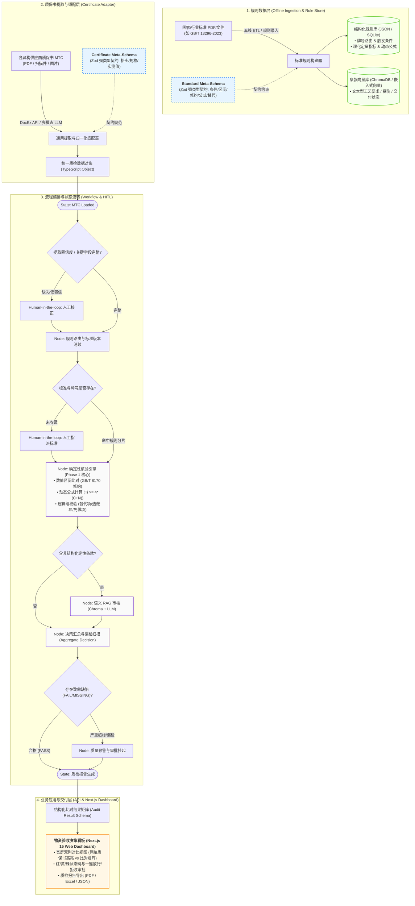
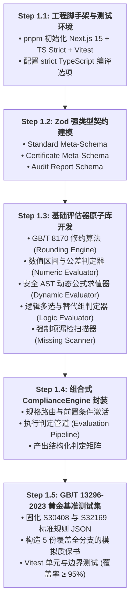

# NormScale 实施计划：Phase 1 元模型与确定性规则核验引擎

本项目（NormScale）旨在构建一个**基于工业国家/行业执行标准的质量证明书（MTC）合规检验引擎与智能比对系统**。针对物资采购验收中“供应商质保书格式异构、执行标准繁杂多变、数值校验零容错、前置与替代条件复杂”的痛点，采用**“确定性规则判别为主、LLM 语义核验为辅”的双轨架构**。

---

## 1. 系统总体架构蓝图 (System Architecture Blueprint)

> [!NOTE]
> 本架构蓝图展示系统全局流转机制。当前实施范围严格限定于 **Layer 1 的核心元模型与纯代码确定性规则核验引擎 (Deterministic Evaluator)**。



---

## 2. 技术栈约束与选型对齐

严格遵循项目规则 [tech-stack-constraints.md](file:///Users/shiromaple/Github/NormScale/.agents/rules/tech-stack-constraints.md)：

| 维度 | 规范选型 | 说明 |
|---|---|---|
| **Runtime** | Node.js 22 LTS (`>=22.0.0 <23.0.0`) | 现代 JavaScript/TypeScript 运行时 |
| **Framework** | Next.js 15 (App Router, React 19) | 服务端组件 (RSC) 优先，异步 dynamic APIs |
| **Language** | TypeScript (Strict Mode, 严禁 `any`) | 强类型建模，编译期消除类型漏洞 |
| **Package Manager** | `pnpm` (严格唯一工具) | 严禁使用 npm/npx/yarn，维护 `pnpm-lock.yaml` |
| **Styling** | Tailwind CSS | 现代原子化 CSS |
| **Schema 验证** | Zod (v3) | TypeScript 生态标准，同时支持类型推导与运行时校验 |
| **修约与数值计算** | `bignumber.js` / 原生高精度实现 | 严格实现 GB/T 8170-2008 修约规则，规避浮点数精度陷阱 |
| **动态公式解析** | AST-based Safe Expression Evaluator | 词法与语法树解析，安全求值，杜绝代码注入 |
| **单元与基准测试** | Vitest | ESM 与 TypeScript 原生支持，毫秒级快速断言 |

---

## 3. Phase 1 深度解构与实施规划

### 3.1 Phase 1 要解决的核心问题
Phase 1 的核心目标是构建**零外部依赖、100% 确定性、毫秒级执行的“质检核验纯算力内核”**：
1. **解决标准与质保书的表达契约（Universal Meta-Schema）**：建立品类无关（管/板/棒/非金属通用）的 Zod 数据模型，使标准条款（单边/双边阈值、动态关联公式、替代组合、条件触发）能被程序完全计算化表达。
2. **消除大模型数值幻觉与浮点误差**：以纯算法形式实现《GB/T 8170-2008 数值修约规则》与区间判定，杜绝由于 LLM 概率生成或 JavaScript 浮点数舍入（如 `0.1 + 0.2`）导致的质检误判。
3. **支持工业级复杂条件与逻辑组**：
   - 前置触发（如壁厚 $\ge 1.7\text{mm}$ 才做硬度）
   - 动态跨字段公式（如 $Ti \ge 5 \times (C+N)$）
   - 逻辑或与替代（如涡流检测 E3H 替代水压试验）
   - 标准免做项（如 07Cr19Ni11Ti 晶间腐蚀免做）
   - 强制项漏检扫描（`MANDATORY` 缺失标记）

### 3.2 为什么必须从 Phase 1 开始？
- **数据契约是一切上层模块的基石**：如果 Meta-Schema 未定稿，后续 DocEx 提取适配、LangGraph 状态机、API 接口和前端展示均没有稳定的数据输入输出结构（锚点）。
- **最小爆炸半径与闭环验证**：Phase 1 属于**纯函数（Pure Functions）**范畴，无数据库、网络 I/O 或 LLM Token 开销，可以在秒级内通过离线单元测试覆盖 100% 边界，保障内核的绝对可靠。

---

### 3.3 Phase 1 具体实现步骤



#### Step 1.1: 工程脚手架初始化
- 确保 Node 22 环境，配置 `package.json`（严格使用 `pnpm`）。
- 配置 TypeScript `tsconfig.json`（`strict: true`, `noImplicitAny: true`）。
- 配置 `vitest` 测试运行环境。

#### Step 1.2: 通用元模型定义 (Zod Schemas & TS Types)
- `src/schemas/standard.schema.ts`：
  - `StandardMeta`、`ApplicabilityScope`、`EvaluationRule`（包含 `numeric_range`, `dynamic_expression`, `or_choice_group`, `alternative_group`, `qualitative_enum`, `exemption`）。
- `src/schemas/certificate.schema.ts`：
  - `CertificateHeader`、`TestRecord`（实测数值、原始字符串、单位、试验方法）。
- `src/schemas/report.schema.ts`：
  - 判定结果矩阵（状态枚举：`PASS`, `FAIL`, `MISSING`, `EXEMPT`, `SKIPPED`, `EXTRA`，公差偏移量分析）。

#### Step 1.3: 核心评估器原子开发
- `src/engine/rounding.ts`：严格遵循 GB/T 8170 的修约逻辑（“四舍六入五考虑，五后非零则进一，五后皆零视奇偶，五前为奇则进一，五前为偶则舍去”）。
- `src/engine/numeric-evaluator.ts`：区间比对（闭区间、开区间、半开半闭、单边边界、修约后比对）。
- `src/engine/dynamic-evaluator.ts`：安全 AST 表达式求值器（注入上下文 `ctx`，仅支持安全数学运算，解析如 `5 * (ctx.chemical.C + ctx.chemical.N)`）。
- `src/engine/logic-evaluator.ts`：处理 `or_choice_group` 与 `alternative_group`（任一达标即放行）。
- `src/engine/missing-scanner.ts`：比对 `grade_rules` 中的 `MANDATORY` 规则，扫描质保书未报送项。

#### Step 1.4: 统一 ComplianceEngine 调度入口
- `src/engine/core.ts`：实现 `evaluateCertificate(standardRule, certificateData): AuditReport` 管道流水线。

#### Step 1.5: 黄金基准测试集验证
- `data/standards/GB_T_13296_2023.json`：提取并固化《GB/T 13296-2023》中 S30408 与 S32169 两个典型牌号的标准规则。
- `tests/engine/*.test.ts`：针对修约临界点、微小超标、动态公式求值、涡流替代水压、免做项等编写全面的单元测试。

---

## 4. Phase 1 验证方案与退出门禁 (Gate Criteria)

### 4.1 自动化测试指标
1. **测试执行**：运行 `pnpm test` 全绿，测试用例通过率 100%。
2. **代码覆盖率**：`src/engine/` 核心计算模块语句覆盖率（Stmt）$\ge 95\%$，分支覆盖率（Branch）$\ge 90\%$。
3. **类型安全检查**：运行 `pnpm tsc --noEmit` 零警告、零报错，代码中无 `any` 类型声明。

### 4.2 业务基准真值验证 (Ground Truth Cases)
采用 5 组针对《GB/T 13296-2023》的标准用例进行自动化核验：
- **Case 1 (全合格)**：S30408 冷拔换热管（各元素在区间内、Rm=565MPa、涡流 E3H 代替液压合格） $\to$ 整体判定 `PASS`。
- **Case 2 (微小超标)**：碳含量 $C=0.086\%$（修约后为 $0.09\%$，超标） $\to$ 判定 `FAIL`，准确指出超标量 $+0.006\%$。
- **Case 3 (动态公式达标/未达标)**：S32169 牌号 $Ti$ 实测值低于 $4 \times (C+N)$ $\to$ 判定 `FAIL`。
- **Case 4 (条件豁免与跳过)**：壁厚 $1.5\text{mm}$（$<1.7\text{mm}$）未测硬度 $\to$ 判定 `SKIPPED`（不报警）；S32169 未测晶间腐蚀 $\to$ 判定 `EXEMPT`。
- **Case 5 (强制项漏检)**：质保书未报送超声波探伤 $\to$ 判定 `MISSING`，全局触发质量警报。

---

### 4.3 准入 Phase 2 的退出门禁（Exit Criteria）

只有同时满足以下 **4 项硬性指标** 时，Phase 1 方可正式结项并准入 Phase 2：

```
[Phase 1 结项门禁清单]
☑ 1. Schema 契约完备：Zod 模型支持全部数值/公式/逻辑/免做表达，通过 TS strict 编译。
☑ 2. 修约算法零误差：GB/T 8170 算法通过全部奇偶修约边界用例，单次核验延迟 < 1ms。
☑ 3. 黄金用例 100% 通过：5 组 GB/T 13296-2023 真值用例判定结论与人工判定完全一致。
☑ 4. 纯净零外部 IO：无数据库、无网络 API 依赖，纯内存函数式运行。
```
