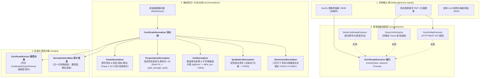

# Phase 3 技术实施方案：质保书提取抽象接口与确定性归一化流水线

## 1. 目标与背景

在工业实际业务中，由于供应商质量证明书（MTC）格式各异、排版极其多样，即使通过 DocEx 微服务或大模型多模态（Vision LLM）进行了初步抽取，LLM 的不确定性仍会导致输出数据存在大量噪声与异构表达：
- **牌号书写不规范**：`0Cr18Ni9`, `SUS 304`, `TP-316L`, `904 L`, `06Cr19Ni10`, `ASTM A213 TP304` 混用；
- **检验项名称不统一**：`屈服强度`, `ReH`, `Rp0.2`, `YS`, `0.2% Yield`，或 `Rm`, `抗拉强度`, `Tensile Strength`；
- **数值与单位混杂**：抽取结果可能为 `"520 MPa"`, `"520N/mm2"`, `"53.0 kgf/mm²"`, `"75.4 ksi"`, `"0.04 %"`, `"<0.01"`；
- **定性试验结论多样**：`"合格"`, `"OK"`, `"Pass"`, `"无裂纹"`, `"未见开裂"`, `"完好"`, `"符合 GB/T 13296"`;
- **几何尺寸表达形式各异**：`"Φ25×2.0×6000"`, `"25*2.0*6000mm"`, 或零散拆分在外径/壁厚中。

**Phase 3 的核心使命**：
构建**高鲁棒性、纯代码驱动的确定性归一化流水线（Deterministic Normalization Pipeline）**与**多后端提取抽象接口（ICertificateExtractor）**，彻底清洗与消歧上游抽取的脏数据，生成 100% 符合 [CertificateExtractSchema](file:///Users/shiromaple/Github/NormScale/src/schemas/certificate.schema.ts) 的统一强类型质检对象，为 Phase 4 规则比对与合规决策提供坚实底座。

---

## 2. 总体架构与数据流转设计



---

## 3. 核心技术模块详细设计

### 3.1 提取抽象适配层 (`src/extractor/`)

- **`extractor.interface.ts`**：
  - 定义 `ICertificateExtractor` 抽象契约：
    ```typescript
    export interface ExtractOptions {
      timeoutMs?: number;
      enableOcrConfidence?: boolean;
      customPrompt?: string;
    }

    export interface RawExtractedField<T = unknown> {
      value: T;
      raw_text?: string;
      confidence?: number; // 0.0 ~ 1.0
      bbox?: [number, number, number, number]; // OCR 坐标框 (若有)
    }

    export interface RawCertificatePayload {
      header?: Record<string, unknown>;
      dimensions?: Record<string, unknown>;
      test_records?: Array<Record<string, unknown>>;
      unstructured_notes?: string[];
      overall_confidence?: number;
    }

    export interface ICertificateExtractor {
      extract(input: Buffer | Uint8Array | string, options?: ExtractOptions): Promise<RawCertificatePayload>;
    }
    ```
- **`mock-extractor.ts`**：内置典型真实质保书（奥氏体 S30408/S31603、铁素体 S11710 等）的确定性 Mock 实现，支撑零外部网络依赖的离线单测与 CI。
- **`docex-http-extractor.ts`**：通过 `fetch` 调用 DocEx REST 端点，具备超时控制、重试与结构适配能力。
- **`direct-llm-extractor.ts`**：多模态大模型直连提取框架（支持传入 Base64 图像或 PDF）。

---

### 3.2 确定性归一化引擎 (`src/normalizer/`)

#### (1) 牌号消歧器 (`GradeNormalizer`)
- **职责**：解决所有非标牌号、历史代号与国际等效牌号的清洗与映射。
- **算法与机制**：
  1. 字符串预处理：去除前后缀（如 `ASTM A213/A213M`, `GB 13296`）、去除空格、换行、连字符 `-`，转大写；
  2. 规则库联动：直接调用 Phase 2 的 `IRuleStore.resolveRuleSlice(standardId, normalizedGrade)`；
  3. 智能消歧：
     - 若输入 `SUS304` / `TP304` / `0Cr18Ni9` $\to$ 准确映射至 `S30408 (06Cr19Ni10)`；
     - 若输入 `316L` / `TP-316L` $\to$ 映射至 `S31603 (022Cr17Ni12Mo2)`；
     - 若输入 `904L` $\to$ 映射至 `S39042 (015Cr21Ni26Mo5Cu2)`；
     - 若输入 `254SMO` $\to$ 映射至 `S31252 (015Cr20Ni18Mo6CuN)`；
     - 若输入未知牌号 $\to$ 保留原字符串并生成 `UNRECOGNIZED_GRADE` 预警，供 Phase 4 人工确认（HITL）。

#### (2) 物理量单位换算器 (`UnitNormalizer`)
- **职责**：将任意单位制与带单位字符串统一为国家标准基准单位，使用 `BigNumber` 确保零精度损失。
- **换算规则矩阵**：
  | 检验类别 | 常见异构输入 | 目标基准单位 | 换算系数 / 逻辑 |
  |---|---|---|---|
  | **强度 (力学)** | `MPa`, `N/mm²` | `MPa` | $1:1$ |
  | **强度 (力学)** | `kgf/mm²`, `kg/mm²` | `MPa` | $\text{val} \times 9.80665$ |
  | **强度 (力学)** | `psi` | `MPa` | $\text{val} \times 0.00689476$ |
  | **强度 (力学)** | `ksi` | `MPa` | $\text{val} \times 6.89476$ |
  | **伸长率 / 含量** | `40%`, `40`, `0.04%` | `%` | 清洗提取纯数值，单位设为 `%` |
  | **硬度** | `85 HRB`, `180 HBW`, `200 HV` | `HRB`/`HBW`/`HV` | 提取子类型与数值 |
  | **长度 / 尺寸** | `25mm`, `2.5cm`, `6m`, `1 inch` | `mm` | 统一换算为毫米 ($mm$) |
  | **冲击吸收能量** | `J`, `焦耳`, `kgf·m` | `J` | $1 \text{kgf}\cdot\text{m} = 9.80665\text{J}$ |
- **前缀符号剥离**：自动识别并剥离 `<0.01`, `<=0.005`, `>500` 等符号，提取 `comparison_operator` 与净数值。

#### (3) 检验项名称与类别归一化器 (`PropertyKeyNormalizer`)
- **职责**：将上百种中英文、缩写名称统一映射为标准定义的 `property_key` 与 `category`。
- **典型映射字典**：
  - `屈服强度` / `规定塑性延伸强度` / `ReH` / `ReL` / `Rp0.2` / `YS` $\to$ `yield_strength_rp02` (`category: mechanical`)
  - `抗拉强度` / `抗张强度` / `Rm` / `TS` / `Tensile` $\to$ `tensile_strength` (`category: mechanical`)
  - `断后伸长率` / `延伸率` / `A` / `EL` / `A50` $\to$ `elongation_A` (`category: mechanical`)
  - `碳` / `C` / `Carbon` $\to$ `C` (`category: chemical`)
  - `晶粒度` / `奥氏体晶粒度` / `Grain Size` $\to$ `grain_size` (`category: metallographic`)
  - `压扁试验` / `Flattening` $\to$ `flattening_test` (`category: process`)
  - `晶间腐蚀` / `Intergranular Corrosion` / `IGC` $\to$ `intergranular_corrosion` (`category: corrosion`)
  - `超声波探伤` / `UT` / `Ultrasonic` $\to$ `ultrasonic_test` (`category: ndt`)
  - `涡流探伤` / `ET` / `Eddy Current` $\to$ `eddy_current_test` (`category: ndt`)
  - `液压试验` / `水压试验` / `Hydrostatic` $\to$ `hydraulic_test` (`category: ndt`)

#### (4) 定性结论归一化器 (`QualitativeNormalizer`)
- **职责**：将文本型结论统一映射为 `'PASS'` / `'FAIL'` / `'NOT_TESTED'`。
- **语义归一化规则**：
  - 合格语义：`"合格"`, `"PASS"`, `"OK"`, `"符合要求"`, `"未见裂纹"`, `"完好"`, `"无缺陷"`, `"NO_CRACKS"`, `"YES"` $\to$ `'PASS'`
  - 不合格语义：`"不合格"`, `"FAIL"`, `"NG"`, `"开裂"`, `"超标"`, `"有缺陷"` $\to$ `'FAIL'`
  - 未检语义：`"未做"`, `"免做"`, `"未测试"`, `"-"`, `"/"`, `"N/A"` $\to$ `'NOT_TESTED'`

#### (5) 几何规格字符串解析器 (`DimensionNormalizer`)
- **职责**：解析形如 `"Φ25×2.0×6000"`, `"25*2.0*6000"`, `"外径25 壁厚2.0 长度6m"` 的复合规格，精准解构为 `outer_diameter_mm: 25.0`, `wall_thickness_mm: 2.0`, `length_mm: 6000`。

#### (6) 归一化总控流水线 (`CertificateNormalizer`)
- **职责**：按顺序组装上述子归一化器，对传入的 `RawCertificatePayload` 进行全量清洗与类型提升，产出标准 `CertificateExtract`，同时产出详细的 `NormalizationAuditLog`（记录每一个字段被清洗前后的值、转换规则与预警信息）。

---

## 4. 目录与文件变更计划

```
src/
├── extractor/                          # [NEW] 质保书提取抽象与适配层
│   ├── extractor.interface.ts          # ICertificateExtractor 接口与 Payload 定义
│   ├── mock-extractor.ts               # 本地确定性 Mock 提取器 (真实质保书样本)
│   ├── docex-http-extractor.ts         # DocEx REST API 客户端适配器
│   ├── direct-llm-extractor.ts         # 多模态 LLM 直连适配器基类
│   └── index.ts                        # 提取层统一导出
├── normalizer/                         # [NEW] 确定性归一化与消歧流水线
│   ├── grade-normalizer.ts             # 牌号清洗与别名消歧器
│   ├── unit-normalizer.ts              # 物理量数值与单位换算器 (BigNumber)
│   ├── property-key-normalizer.ts      # 检验项名称与类别归一化器
│   ├── qualitative-normalizer.ts       # 定性结论归一化器
│   ├── dimension-normalizer.ts         # 几何尺寸规格表达式解构器
│   ├── certificate-normalizer.ts       # 归一化总控流水线 Orchestrator
│   └── index.ts                        # 归一化层统一导出
└── index.ts                            # 顶层导出更新

tests/
├── fixtures/
│   └── certificates/                   # [NEW] 真实工业质保书原始抽取样本 (含噪声/脏数据)
│       ├── raw_mtc_s30408_messy_units.json   # 牌号别名、带单位、异构名称样本
│       ├── raw_mtc_s31603_foreign_kgf.json   # 日标 SUS316L, kgf/mm², 尺寸复合字符串样本
│       └── raw_mtc_s32169_low_confidence.json # 钛管低置信度与缩写样本
├── normalizer/
│   ├── grade-normalizer.test.ts        # 牌号消歧与切片命中单测
│   ├── unit-normalizer.test.ts         # 物理量单位换算与数值剥离单测
│   ├── property-key-normalizer.test.ts # 检验项名称映射单测
│   ├── qualitative-normalizer.test.ts  # 定性结论转换单测
│   ├── dimension-normalizer.test.ts    # 几何规格字符串解析单测
│   └── certificate-normalizer.test.ts  # 完整质保书端到端归一化集成测试
└── extractor/
    └── mock-extractor.test.ts          # 提取适配器与 Mock 提取单测
```

---

## 5. 验证计划与质量指标

1. **确定性清洗与单位换算单测**：
   - 测试所有支持的物理量单位（$kgf/mm^2$, $psi$, $ksi$, $mm$, $cm$, $m$, $J$）换算精度，验证无浮点误差。
   - 测试带符号前缀字符串（`"<0.01"`, `">=520"`）的正确解构。
2. **牌号消歧与别名匹配单测**：
   - 验证 `SUS304`, `TP-304`, `0Cr18Ni9`, `316L`, `TP316L`, `904L`, `254SMO`, `TP430` 等全部精准映射到对应的国标切片统一代号。
3. **真实端到端归一化与核验引擎贯通验证**：
   - 将充满噪声与异构单位的原始 JSON 传入 `CertificateNormalizer`，输出 `CertificateExtract`；
   - 将归一化后的数据直接传入 Phase 1/Phase 2 的 `ComplianceEngine.evaluate()`，验证能否零报错、全自动完成合规性核验！
4. **自动化测试与类型检查**：
   - 执行 `pnpm test:coverage && pnpm typecheck && pnpm standard:validate`，要求全部测试 100% 通过，覆盖率维持在 90% 以上。
