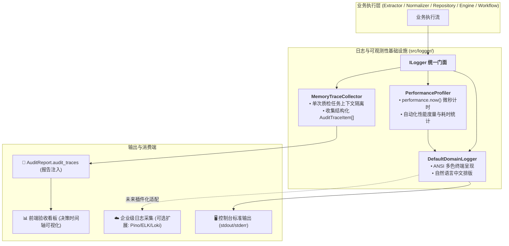

# NormScale 领域日志与可观测性系统使用与运维指南

本文档面向 **系统开发工程师、质检业务专家与生产运维人员**，系统化指导如何使用、调试、维护与扩展 NormScale 的日志系统（Logger）、性能分析器（Profiler）与业务审验轨迹流（Audit Trace Collector）。

---

## 1. 架构定位与核心理念

NormScale 的日志系统在设计上明确区分了 **“系统基础设施日志”** 与 **“业务审验轨迹”**：



### 核心设计原则：
1. **门面模式（Facade Pattern）**：核心业务代码仅依赖 `ILogger` 与 `ITraceCollector` 抽象，不与具体日志实现强绑定，实现业务与基础设施的完全解耦。
2. **人类可读优先（Human-Readable First）**：所有日志均采用通俗、严谨的中文自然语言输出（包含原始牌号、消歧主牌号、单位换算公式、超标详情及判定依据）。
3. **零外部强依赖**：默认实现基于 Node.js 22 原生特性编写，零第三方体积包负担，天然兼容 Next.js 15 App Router、SSR 及 Edge Runtime。
4. **单次任务轨迹聚合**：支持将单次质保书核验的决策步骤自动组装进 `AuditReport.audit_traces`，直接赋能前端看板抽屉的可视化渲染。

---

## 2. 日志级别与模块标签规范

### 2.1 日志严重级别（LogLevel）

| 级别 | 严重度数值 | 应用场景与输出规范 |
|---|---|---|
| `debug` | 10 | **最详尽的底层执行细节**：倒排索引 key 匹配过程、AST 公式语法树解析、GB/T 8170 舍入修约中间值、合格单项明细。 |
| `info` | 20 | **关键业务里程碑与正常流转**：规则仓库切片装载数量、牌号成功消歧、复合尺寸解构完成、质保证书清洗完成、全单核验结论裁决。 |
| `warn` | 30 | **潜在业务异常与质检警示**：未收录材料牌号、强制项漏检（MISSING）、单项指标超标（FAIL）、协议选做项未提供、网络请求超时重试。 |
| `error` | 40 | **系统级致命故障**：网络连接彻底断开、文件读取损坏、底层未捕获异常。 |
| `silent` | 99 | **完全静默**：关闭所有控制台输出（在运行大量自动化单元测试时默认使用）。 |

### 2.2 领域模块标签（LogModuleTag）

所有日志输出时均需明确指定模块标签，以便于日志过滤与链路追踪：

- `[EXTRACTOR]`：质保书抽取层（DocEx HTTP 请求、Mock 样本加载、多模态 Vision LLM 抽取）；
- `[NORMALIZER]`：确定性清洗层（牌号别名消歧、物理量单位换算、几何尺寸复合表达式解构）；
- `[REPOSITORY]`：规则仓库层（标准库冷启动、规格切片倒排索引查找、文本条款全文检索）；
- `[ENGINE]`：核心核验引擎层（规则循环评估、前置条件激活、AST 动态求值、一票否决裁决）；
- `[WORKFLOW]`：状态图工作流调度层（LangGraph 节点流转、HITL 人机协同断点与恢复）；
- `[PERF]`：性能度量层（微秒级函数执行耗时与阶段耗时统计）；
- `[SYSTEM]`：系统初始化与全局生命周期。

---

## 3. 开发者使用指南 (Developer Guide)

### 3.1 引入与基本打印

```typescript
import { logger } from '@/logger';

// 1. 标准输出
logger.info('NORMALIZER', '牌号 [SUS 304] 成功消歧为标准主牌号 [06Cr19Ni10]');
logger.warn('ENGINE', '[不合格] 屈服强度: 实测值 205 MPa 低于标准下限 215 MPa');
logger.debug('REPOSITORY', '倒排索引命中规格切片 [S30408_06Cr19Ni10]');

// 2. 带有结构化元数据或异常对象
try {
  // 业务逻辑
} catch (err) {
  logger.error('EXTRACTOR', 'DocEx 接口通信失败', err, { retryCount: 3, timeoutMs: 5000 });
}
```

### 3.2 使用固定模块子日志器 (`forTag`)

对于高内聚的单一模块，可使用 `forTag` 创建绑定了特定标签的子日志器，简化调用：

```typescript
import { logger } from '@/logger';

const engLog = logger.forTag('ENGINE');

engLog.info('启动合规性核验引擎...');
engLog.debug('开始比对第 1 项规则: 碳含量 C');
engLog.warn('[漏检] 超声波探伤 UT 质保书中未提供实测数据');
```

### 3.3 测量并输出微秒级性能耗时 (`PerformanceProfiler`)

使用 `PerformanceProfiler` 能够以非侵入式方式测量同步/异步代码块的耗时：

```typescript
import { PerformanceProfiler } from '@/logger/profiler';
import { logger } from '@/logger';

// 1. 测量同步操作
const { result, duration_ms } = PerformanceProfiler.profileSync(
  'ENGINE',
  'AST 动态公式求值',
  () => evaluateComplexFormula(astTree, context),
  logger
);

// 2. 测量异步网络请求
const payload = (await PerformanceProfiler.profileAsync(
  'EXTRACTOR',
  'DocEx 远程质保书抽取',
  async () => docexClient.extractPdf(fileBuffer),
  logger
)).result;
```

### 3.4 收集单次质检流转的自然语言审计轨迹 (`TraceCollector`)

在执行单次质保书核验时，创建 `ITraceCollector` 并注入到流程中，所有自然语言过程将自动组装并随 `AuditReport` 输出：

```typescript
import { MemoryTraceCollector } from '@/logger';
import { CertificateNormalizer } from '@/normalizer';
import { ComplianceEngine } from '@/engine';

// 1. 为本次质检请求创建独立的轨迹收集器
const collector = new MemoryTraceCollector('MTC-2026-08891');

// 2. 传入清洗流水线（自动记录牌号消歧、单位换算过程）
const { certificate } = await normalizer.normalize(rawPayload, { collector });

// 3. 传入核验引擎（自动记录每项指标裁决依据与全局决策）
const report = ComplianceEngine.evaluate(standardRuleSet, certificate, { collector });

// 4. 获取包含轨迹流与性能指标的完整报告
console.log(report.audit_traces);       // AuditTraceItem[]
console.log(report.performance_metrics); // { total_duration_ms: 5.23, phase_durations: {...} }
```

---

## 4. 运行期配置与调试 (Operations & Debugging)

### 4.1 通过环境变量调节日志级别

在终端启动服务或运行测试时，通过 `LOG_LEVEL` 环境变量即可全局调节日志输出级别：

```bash
# 开发环境：查看标准业务信息与性能耗时
LOG_LEVEL=info pnpm dev

# 深度排查：查看包含倒排索引命中与公式计算的全部 debug 日志
LOG_LEVEL=debug pnpm dev

# 运行单测时显式开启日志输出，观察真实业务流转
LOG_LEVEL=info pnpm test tests/logger/trace-collector.test.ts

# 生产环境：仅输出警告与错误
LOG_LEVEL=warn pnpm start
```

### 4.2 禁用 ANSI 彩色输出

在不支持 ANSI 颜色转义字符的 CI 容器或特定日志收集日志流中，可通过 `NO_COLOR=1` 禁用多色高亮：

```bash
NO_COLOR=1 LOG_LEVEL=info pnpm test
```

---

## 5. 生产运维与企业级日志库对接 (Enterprise Extension)

在未来的生产加固阶段（Phase 7），如果企业运维平台要求将日志直接以 JSON 格式输出至标准输出，或流式直连到 **ELK / Datadog / Grafana Loki**，得益于门面模式，只需编写一个简单的适配器即可：

### 示例：对接 `pino` 适配器（仅需约 20 行代码）

```typescript
import pino from 'pino';
import { ILogger, IModuleLogger, ITraceCollector, LogLevel, LogModuleTag } from '@/logger/logger.interface';
import { MemoryTraceCollector } from '@/logger/trace-collector';

export class PinoLoggerAdapter implements ILogger {
  private pinoInstance = pino({ level: process.env.LOG_LEVEL || 'info' });

  public info(tag: LogModuleTag, message: string, metadata?: Record<string, unknown>): void {
    this.pinoInstance.info({ tag, ...metadata }, message);
  }

  public warn(tag: LogModuleTag, message: string, metadata?: Record<string, unknown>): void {
    this.pinoInstance.warn({ tag, ...metadata }, message);
  }

  public error(tag: LogModuleTag, message: string, error?: Error | unknown, metadata?: Record<string, unknown>): void {
    this.pinoInstance.error({ tag, err: error, ...metadata }, message);
  }

  public debug(tag: LogModuleTag, message: string, metadata?: Record<string, unknown>): void {
    this.pinoInstance.debug({ tag, ...metadata }, message);
  }

  public perf(tag: LogModuleTag, name: string, duration_ms: number, metadata?: Record<string, unknown>): void {
    this.pinoInstance.info({ tag, duration_ms, ...metadata }, `${name} 耗时 ${duration_ms.toFixed(2)}ms`);
  }

  public forTag(tag: LogModuleTag): IModuleLogger {
    return {
      tag,
      debug: (msg, meta) => this.debug(tag, msg, meta),
      info: (msg, meta) => this.info(tag, msg, meta),
      warn: (msg, meta) => this.warn(tag, msg, meta),
      error: (msg, err, meta) => this.error(tag, msg, err, meta),
      perf: (name, dur, meta) => this.perf(tag, name, dur, meta),
    };
  }

  public createTraceCollector(contextId?: string): ITraceCollector {
    return new MemoryTraceCollector(contextId);
  }
}
```
**接入方式**：在 `src/logger/index.ts` 中将 `export const logger = new PinoLoggerAdapter();` 替换默认实现，全系统其他数千行核心代码**无需做任何改动**！

---

## 6. 常见问题排查 (FAQ)

### Q1: 为什么在终端执行 `pnpm test` 时看不到任何日志？
* **原因**：为了避免 90+ 项单元测试执行时大量日志冲刷控制台屏幕，测试环境（Vitest）默认将级别设为 `silent`。
* **解决**：在运行测试时显式指定环境变量，例如：`LOG_LEVEL=info pnpm test`。

### Q2: 生产环境生成的 `AuditReport` 中没有 `audit_traces` 字段？
* **原因**：调用 `ComplianceEngine.evaluate()` 或 `CertificateNormalizer.normalize()` 时未传入 `{ collector }` 参数。
* **解决**：确保在 Controller / API Route 处理入口处实例化 `const collector = new MemoryTraceCollector(certNo)` 并传入 options 参数。

### Q3: 如何在日志中追踪单次质检请求的全链路日志？
* **方案**：创建子日志器或在 metadata 中传递 `traceId` / `certificateNo`，例如：`logger.info('ENGINE', '开始核验', { traceId: 'REQ-12345' })`。
