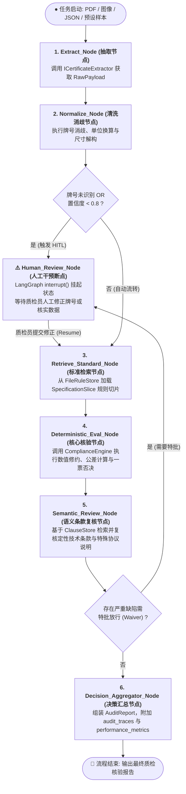

# Phase 5: LangGraph 状态图与人机协同（HITL）编排层实施方案

## 1. 目标与背景

随着 Phase 1（确定性核验引擎）、Phase 2（规则切片仓库与全量标准入库）、Phase 3（质保书提取抽象与归一化流水线）以及 Phase 4（领域日志系统与性能度量）的全部交付，NormScale 已拥有完备的底层核验与清洗算力。

本阶段（**Phase 5**）的核心目标是：**将零散的抽取、清洗、规则检索、确定性核验、条款语义复核以及人工干预节点，编排为一个强健、高可观测且具备中断/恢复（Human-in-the-Loop, HITL）能力的 LangGraph 状态图工作流引擎**。

---

## 2. 状态图架构与流程拓扑



---

## 3. 核心技术设计

### 3.1 状态数据模型 (`QualityAuditState`)
在 LangGraph 中定义专用的状态通道（Channels）：
```typescript
export interface QualityAuditState {
  /** 任务唯一标识 */
  task_id: string;
  /** 原始输入 */
  input: Buffer | Uint8Array | string;
  /** 运行期配置参数 (例如置信度阈值、超时时间) */
  options?: WorkflowOptions;
  /** 提取层原始载荷 */
  raw_payload?: RawCertificatePayload;
  /** 归一化后的标准质检对象 */
  normalized_cert?: CertificateExtract;
  /** 归一化审计日志 */
  normalization_audit?: NormalizationAuditLog;
  /** 命中的标准规则全集或规格切片 */
  standard_ruleset?: StandardRuleSet;
  /** 规则引擎核验明细矩阵 */
  item_results?: RuleEvaluationItemResult[];
  /** 语义条款复核明细 */
  semantic_review_results?: SemanticReviewItem[];
  /** 人机协同中断上下文 (挂起原因、待人工确认字段、建议值) */
  hitl_context?: HitlInterruptContext;
  /** 人工修正数据回填 */
  human_correction?: HumanCorrectionInput;
  /** 最终完整核验报告 */
  final_report?: AuditReport;
  /** 状态流转状态 */
  workflow_status: 'extracting' | 'normalizing' | 'evaluating' | 'reviewing' | 'awaiting_human_review' | 'completed' | 'failed';
  /** 错误信息 */
  error?: string;
}
```

### 3.2 人机协同（HITL）中断与恢复机制
利用 LangGraph 的 `interrupt()` 与 `MemorySaver` Checkpointer：
1. **自动挂起触发条件**：
   - 牌号未能消歧命中规则切片（`grade_normalization.is_matched === false`）；
   - OCR 整体置信度低于阈值（如 `< 0.8`）或关键受检指标存在识别歧义；
   - 出现一票否决严重缺陷但属于允许人工特批放行（Waiver）的协议条款。
2. **恢复机制（Resume）**：
   - 质检员在前端面板上查看挂起详情并提交人工修正数据（如将未知牌号指定为 `S30408` 或手动修正数值）；
   - 调用 `workflowEngine.resumeTask(taskId, correctionData)`，图引擎从 Checkpoint 精确恢复，继续执行后续核验流程。

---

## 4. 详细实施步骤与文件清单

### 步骤 1: 依赖引入
- 使用 `pnpm add @langchain/langgraph @langchain/core` 安装 LangGraph 状态图引擎与 Checkpointer。

### 步骤 2: 状态契约与节点实现 (`src/workflow/`)
1. `src/workflow/state.interface.ts`: 定义 `QualityAuditState`、`WorkflowOptions`、`HitlInterruptContext`、`HumanCorrectionInput`。
2. `src/workflow/nodes/extract.node.ts`: 抽取节点。
3. `src/workflow/nodes/normalize.node.ts`: 归一化清洗节点。
4. `src/workflow/nodes/retrieve-standard.node.ts`: 标准与切片检索节点。
5. `src/workflow/nodes/deterministic-eval.node.ts`: 核心规则核验节点。
6. `src/workflow/nodes/semantic-review.node.ts`: 文本条款语义复核节点。
7. `src/workflow/nodes/human-review.node.ts`: HITL 中断与状态挂起节点。
8. `src/workflow/nodes/decision-aggregator.node.ts`: 决策聚合与报告组装节点。

### 步骤 3: 状态图编排与总控引擎 (`src/workflow/audit-graph.ts`, `src/workflow/workflow-engine.ts`)
- 组装 `StateGraph`，配置条件边（Conditional Edges）与 Checkpointer；
- 封装 `WorkflowEngine` 高层外观类，提供 `submitAudit()`、`resumeAudit()`、`getTaskState()` 等高层 API。

### 步骤 4: 根导出与单元测试
- 在 `src/index.ts` 中导出 `src/workflow`；
- 编写专项单测：`tests/workflow/audit-graph.test.ts`、`tests/workflow/workflow-engine.test.ts`；
- 验证 Happy Path 自动全通、HITL 挂起与恢复全流程。
