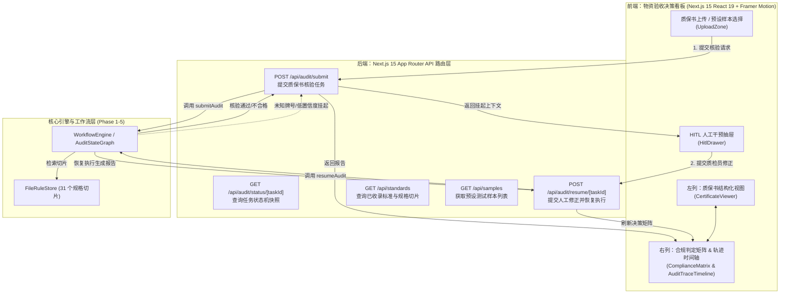

# Phase 6 实施计划：Next.js 15 API 服务层与物资验收决策看板构建

构建 NormScale 的 **业务应用与交付层（Next.js 15 App Router API & Web Dashboard）**，将底层的 LangGraph 状态图工作流引擎与确定性核验算力无缝接入现代化 Web 看板，为物资验收质检工程师提供直观、高效的决策支持系统。

---

## 用户评审要点

> [!IMPORTANT]
> **1. 前端设计与样式硬性规范**：
> - **视觉风格**：现代极简、排版层级分明、低饱和度专业工业质感（Slate/Zinc/Neutral 沉稳色系）；
> - **无 Emoji 纯矢量图标**：严禁在按钮、标题与状态中使用 Emoji，全面使用 `lucide-react` 矢量图标；
> - **样式与组件标准**：禁止裸写非标自定义 CSS，必须使用 Tailwind CSS 工具类与 `shadcn/ui` 原子组件；
> - **交互与动效**：使用 `framer-motion` 实现列表平滑淡入与高度自适应，所有交互按钮配置 `active:scale-95 duration-150` 点击回弹触感；
> - **字号与排版约束**：
>   * 正文、表格内容、表单 Label、按钮文本一律使用 `text-sm` (14px) 或 `text-base` (16px)，配合 `leading-normal` / `leading-relaxed`；
>   * 严禁在按钮、输入框、列表项与卡片正文中滥用 `text-xs`（`text-xs` 仅限用于时间戳与微型数字角标）；
>   * 通过字重与颜色对比度区分层级，数值统一应用 `font-mono tabular-nums` 纵向对齐。

> [!NOTE]
> **2. 交互看板核心体验（宽屏双列 + HITL 协同抽屉）**：
> - **左侧：原始质保书结构化视图**（展示供应商声明信息、炉批号、几何尺寸、实测数据卡片与预设快速样本选择器）；
> - **右侧：合规判定矩阵与审计时间轴**（红/黄/绿状态码、各项指标判定依据、AST动态公式展开、文本条款复核结果以及自然语言执行时间轴）；
> - **HITL 人机协同干预抽屉**：当任务触发挂起（如未知牌号或低置信度）时，自动滑出干预抽屉，支持智能建议推荐、质检员人工修正牌号、实测值覆写与特批放行（Waiver）一键恢复流转。

---

## 状态与交互流转架构

---

## 拟变动与新建文件清单

### 1. 依赖管理与基础工程配置

#### [MODIFY] [package.json](file:///Users/shiromaple/Github/NormScale/package.json)
- 安装 `lucide-react`、`framer-motion`、`clsx`、`tailwind-merge`、`class-variance-authority`。

#### [NEW] [next.config.ts](file:///Users/shiromaple/Github/NormScale/next.config.ts)
- Next.js 15 基础配置（启用 React 严格模式、支持 TypeScript 路径别名）。

#### [NEW] [postcss.config.mjs](file:///Users/shiromaple/Github/NormScale/postcss.config.mjs)
- PostCSS 与 Tailwind CSS 预处理器配置。

#### [NEW] [tailwind.config.ts](file:///Users/shiromaple/Github/NormScale/tailwind.config.ts)
- 配置 Tailwind 扫描路径、低饱和度工业色彩主题、等宽排版与微动画阴影系统。

#### [NEW] [src/lib/utils.ts](file:///Users/shiromaple/Github/NormScale/src/lib/utils.ts)
- 提供标准 `cn()` 样式合并函数（`clsx` + `tailwind-merge`）。

---

### 2. Next.js 15 后端 API 路由体系 (`src/app/api/`)

#### [NEW] [src/app/api/audit/submit/route.ts](file:///Users/shiromaple/Github/NormScale/src/app/api/audit/submit/route.ts)
- **POST**：接收 JSON 载荷、预设样本标识或文件输入，执行输入校验，调用 `WorkflowEngine.submitAudit()`，返回 `{ taskId, status, finalReport, hitlContext }`。

#### [NEW] [src/app/api/audit/status/[taskId]/route.ts](file:///Users/shiromaple/Github/NormScale/src/app/api/audit/status/[taskId]/route.ts)
- **GET**：读取 Next.js 15 动态参数（`await params`），调用 `WorkflowEngine.getTaskState(taskId)` 获取当前任务快照。

#### [NEW] [src/app/api/audit/resume/[taskId]/route.ts](file:///Users/shiromaple/Github/NormScale/src/app/api/audit/resume/[taskId]/route.ts)
- **POST**：接收质检员修正数据（`HumanCorrectionInput`），调用 `WorkflowEngine.resumeAudit(taskId, correction)` 恢复状态机执行并返回最新报告。

#### [NEW] [src/app/api/standards/route.ts](file:///Users/shiromaple/Github/NormScale/src/app/api/standards/route.ts)
- **GET**：检索标准规则库，返回已收录的标准代号、名称及 31 个规格切片元数据。

#### [NEW] [src/app/api/samples/route.ts](file:///Users/shiromaple/Github/NormScale/src/app/api/samples/route.ts)
- **GET**：返回系统预设的质保书样本（S30408 标准管、316L 工程制单位管、未知牌号测试样本等），供前端一键载入测试。

---

### 3. 前端交互组件与看板页面 (`src/app/` & `src/components/`)

#### [NEW] [src/app/globals.css](file:///Users/shiromaple/Github/NormScale/src/app/globals.css)
- 导入 Tailwind 指令，定制低饱和度暗色主题、平滑滚动条与等宽字体对齐规范。

#### [NEW] [src/app/layout.tsx](file:///Users/shiromaple/Github/NormScale/src/app/layout.tsx)
- 全局布局组件，设置系统标题、Meta 元数据与字体。

#### [NEW] [src/app/page.tsx](file:///Users/shiromaple/Github/NormScale/src/app/page.tsx)
- **物资验收决策看板主页**：集成顶部导航栏、样本切换/上传区、左侧质保书视图、右侧合规矩阵与时间轴、HITL 协同抽屉。

#### [NEW] [src/components/Header.tsx](file:///Users/shiromaple/Github/NormScale/src/components/Header.tsx)
- 顶部导航组件：包含系统 Logo（`<ShieldCheck />`）、标准库运行状态指标（`<Activity />`）、快速操作区。

#### [NEW] [src/components/UploadZone.tsx](file:///Users/shiromaple/Github/NormScale/src/components/UploadZone.tsx)
- 上传与样本选择器：支持一键选择典型预设样本、拖拽上传文件及自定义运行参数。

#### [NEW] [src/components/CertificateViewer.tsx](file:///Users/shiromaple/Github/NormScale/src/components/CertificateViewer.tsx)
- **左列质保书结构化视图**：清晰展现单据编号、供应商、供货状态、几何尺寸与实测项目卡片。

#### [NEW] [src/components/ComplianceMatrix.tsx](file:///Users/shiromaple/Github/NormScale/src/components/ComplianceMatrix.tsx)
- **右列合规判定矩阵**：
  - 核心总结大卡片（全局结论 PASS / FAIL、合格率进度条、漏检项与不合格项计数）；
  - 判定明细数据表格（`text-sm`，化学成分、力学性能、工艺试验、无损探伤），低饱和度红/绿/琥珀色高亮，支持悬浮查看标准上下限、数值修约过程与 AST 公式求值说明；
  - 漏检项目警示横幅与文本条款语义复核清单。

#### [NEW] [src/components/AuditTraceTimeline.tsx](file:///Users/shiromaple/Github/NormScale/src/components/AuditTraceTimeline.tsx)
- **审计轨迹流与时间轴**：基于 `framer-motion` 动效展示 7 大任务节点的自然语言判定日志，标注微秒级耗时标签与模块分类徽章。

#### [NEW] [src/components/HitlDrawer.tsx](file:///Users/shiromaple/Github/NormScale/src/components/HitlDrawer.tsx)
- **人机协同干预抽屉**（基于 `framer-motion` AnimatePresence 抽屉组件）：
  - 挂起警示面板（显示挂起原因如 `UNKNOWN_GRADE`）；
  - 牌号修正建议选择器（根据相似度推断候选标准牌号）；
  - 实测数据微调表单与特批放行（Waiver）理由输入；
  - "提交修正并恢复核验" 交互按钮。

#### [NEW] [src/lib/api-client.ts](file:///Users/shiromaple/Github/NormScale/src/lib/api-client.ts)
- 封装客户端请求工具函数，包含强类型定义与错误拦截。

---

### 4. 自动化与集成测试套件 (`tests/api/`)

#### [NEW] [tests/api/audit-routes.test.ts](file:///Users/shiromaple/Github/NormScale/tests/api/audit-routes.test.ts)
- 验证 `/api/standards` 返回全量 31 个规格切片；
- 验证 `/api/samples` 返回预设样本；
- 验证 `POST /api/audit/submit` 正常提交与核验报告生成；
- 验证 `POST /api/audit/submit` 未知牌号触发 `suspended_hitl` 挂起；
- 验证 `POST /api/audit/resume/[taskId]` 提交人工修正成功恢复并完成核验；
- 验证 `GET /api/audit/status/[taskId]` 查询状态机快照。

---

## 验证计划

### 自动化测试
1. **API 路由测试**：运行 `pnpm test tests/api/audit-routes.test.ts`，验证所有 App Router 接口逻辑 100% 通过；
2. **全量回归测试**：运行 `pnpm test:coverage`，确保全量 22+ 套件与 110+ 项测试全部通过；
3. **TypeScript 严格类型检查**：运行 `pnpm typecheck`（`tsc --noEmit`），确保前后端代码 0 错误、0 警告；
4. **Next.js 生产构建验证**：运行 `pnpm build`，确保 Next.js 15 App Router 静态生成与服务端打包无任何错误。

### 人工交互验证
1. 启动 `pnpm dev` 打开 `http://localhost:3000`；
2. **场景 1 (Happy Path)**：点击预设样本「S30408 工业样本」，观察看板实时渲染，确认判定矩阵全部 PASS，时间轴显示完整轨迹；
3. **场景 2 (工程制换算 & 漏检一票否决)**：点击「316L 工程制单位样本」，确认抗拉/屈服强度单位自动换算为 MPa，压扁/扩口/晶间腐蚀显示漏检标红，全局结论为 FAIL；
4. **场景 3 (HITL 人机协同交互)**：点击「未知牌号测试样本」，系统自动提示需要人工干预并弹出抽屉，在抽屉中选择 `06Cr19Ni10` 并提交，观察看板无缝恢复并最终生成合格报告；
5. **场景 4 (报告导出)**：点击「导出质检报告」，验证结构化 JSON 下载与打印排版。
