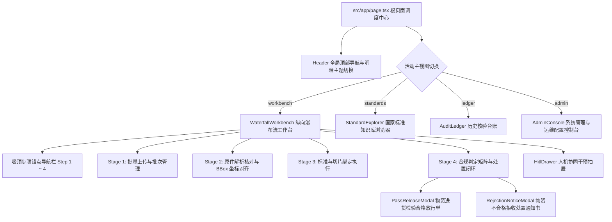

# NormScale 全套前端页面实施方案 (Phase 7 纵向交互贯通)

本项目旨在将 Stitch (Gemini 3.1 Pro) 设计的 7 套高保真工业级 UI/UX 界面全面落地为 Next.js 15 / React 19 / Tailwind CSS 前端代码。

## 核心设计与业务原则
1. **全中文专业语境**：除国家标准代号（`GB/T 13296-2023`）、钢级代号（`S30408`）、工程物理单位（`MPa`, `HBW`）外，界面标签与提示文字全部使用纯正中文。
2. **低饱和度工业极简美学**：采用 `#090d16` 冷灰深邃背景（支持明暗双模一键切换），静谧天青蓝 `#38bdf8` 聚焦，低饱和度翡翠绿 `#059669` 合格放行，低饱和度玫红 `#e11d48` 一票否决。
3. **领域职责与单一真理原则（Single Source of Truth）**：
   - **Stage 02（文档解析核对与归一化）**：源文档 PDF 与 BBox 边界框在此核对，产生标准 Schema 契约数据 `CertificateExtract`；
   - **Stage 04（国家标准合规比对与裁决处置）**：纯粹将 Stage 02 产生的真理数据与国家标准切片规则进行确定性比对，绝不混淆回溯 OCR 原件。
4. **零 Emoji & 严谨排版**：全面使用 `lucide-react` 矢量线性图标，关键参数、公差与时间对齐统一采用 `JetBrains Mono` 等宽字体。

---

## 拟交付的前端组件与页面架构

---

## 详细组件实施清单

### 1. 全局导航与根页面集成
- `src/app/page.tsx`：升级为多主视图调度器（`activeTab: 'workbench' | 'standards' | 'ledger' | 'admin'`），支持全局明暗模式切换（`theme: 'dark' | 'light'`），管理批次任务与模态框状态。
- `src/components/Header.tsx`：升级为主视图切换 Tab、系统运行指标、质检工程师状态徽标与明暗模式切换开关。

### 2. 纵向瀑布流质检工作台 (`src/components/WaterfallWorkbench.tsx`)
- **吸顶步骤锚点栏 (Sticky Step Rail)**：`[ 01 批量上传 ] -> [ 02 解析核对与归一化 ] -> [ 03 标准切片绑定 ] -> [ 04 合规判定与处置 ]`，支持平滑滚动与当前活动步骤监听；
- **Stage 01 批量上传**：进厂批次号 `LOT-20260823-01`，多文件上传接收区与就绪状态指示卡；
- **Stage 02 原件解析核对与 BBox 坐标对齐**：
  - 左侧：PDF/原件视图（带黄/青色 BBox 坐标框与放大/缩小/翻页）；
  - 右侧：解析结构化归一化卡片（展示单位换算 $58.5\text{ kgf/mm}^2 \to 573.68\text{ MPa}$，牌号消歧），生成唯一真理数据；
- **Stage 03 标准与切片绑定执行**：单据标准切片下拉重定向卡片、并发执行状态胶囊（PASS / FAIL / HITL）与“一键核验全批”按钮；
- **Stage 04 合规判定与处置闭环**：
  - 顶部单据快速切换条（`[ 📄 1. MTC-001 ✅合格 ] [ 📄 2. MTC-002 ❌不合格 ] [ 📄 3. MTC-003 ⚠️待复核 ]`）；
  - 双列对比：左侧质保书真理数据表格 vs 右侧标准规则判定矩阵（含大尺寸 FAIL 横幅、3 项强制漏检告警、GB/T 8170 进舍修约过程、微秒耗时时间轴）；
  - 底部操作：`[ 🖨️ 导出合格放行单 ]` 与 `[ 🚨 生成不合格拒收通知书 ]`。

### 3. 处置闭环模态框
- `src/components/PassReleaseModal.tsx`（屏幕 5）：正式公文级排版、翡翠绿质检合格章、4 列信息网格、15 项理化检验全项达标表格、电子签名、SHA-256 存证哈希、A4 打印与 PDF 导出；
- `src/components/RejectionNoticeModal.tsx`（屏幕 4）：正式不合格公文排版、3 项缺失检验事实依据（压扁、承压致密性、晶间腐蚀）、3 类处置决议单选（退货/复验/特批降级）、质检与技术主管会签栏、仓库拒收红色钢印。

### 4. 国家标准知识库与规格切片浏览器 (`src/components/StandardExplorer.tsx`)
- 屏幕 6 还原：左侧 28% 目录树（展示 GB/T 13296-2023 全量 31 个钢级切片，支持搜索与奥氏体/双相钢过滤），右侧 72% 切片详细技术规范（化学成分表、力学性能卡、工艺条款、钛稳定化 $Ti \ge 4 \times (C+N)$ 动态公式求解器）。

### 5. 系统管理与运维配置控制台 (`src/components/AdminConsole.tsx`)
- 屏幕 7 还原：
  - 模块 1：大模型（Gemini 3.1 Pro / Claude 3.7）与解析引擎（内建/DocEx）配置、API Key 掩码管理、OCR 置信度与超时滑块；
  - 模块 2：微秒级终端日志流监视器（支持模块/级别过滤）与当日核验性能监控卡；
  - 模块 3：质检员角色、工号与 CA 数字签名证书管理表格。

### 6. 历史核验台账管理 (`src/components/AuditLedger.tsx`)
- 历史核验记录表格（批次号、证书号、供方、牌号、合格状态、检验员、时间），支持状态筛选与模糊搜索，点击记录一键载入工作台回溯判定矩阵。

---

## 验证计划 (Verification Plan)

1. **单元与集成测试**：
   - 运行 `pnpm test:coverage` 确保所有测试 100% 通过（保持 0 regression）；
   - 新增前端组件测试套件覆盖新建组件的交互。
2. **TypeScript 类型安全**：
   - 运行 `pnpm typecheck` 确保 0 错误、0 警告。
3. **Next.js 15 生产级构建验证**：
   - 运行 `pnpm build` 确保所有 SSR / RSC 路由编译打包通过。
4. **前端浏览器视觉与交互走查**：
   - 在本地 `http://localhost:3000` 上实际操作体验四大主视图切换、瀑布流滚动锚点定位、合格放行单与拒收通知书弹出、标准知识库 31 切片检索与管理后台交互。
