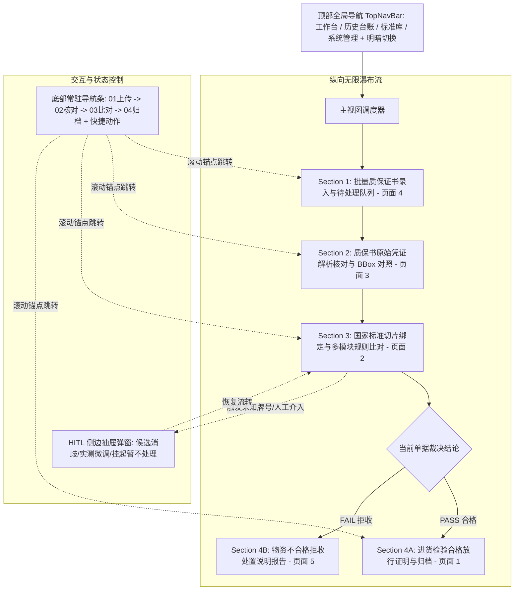

# NormScale 工业设计系统全前端重构实施方案

基于全新工业设计系统规范（[DESIGN.md](file:///Users/shiromaple/Github/NormScale/docs/stitch_normscale_industrial_design_system/normscale_industrial_design_system/DESIGN.md)）及 1、2、3、4、5、HITL 等设计稿，对 NormScale 前端进行系统级重构，落地**纵向无限瀑布流质检工作台**、**底部常驻步骤锚点导航**、**拒收说明报告（页面 5）自适应渲染**、**HITL 侧边抽屉弹窗**与**全站明暗双模自适应**。

---

## 📐 核心架构与设计决策

---

## 🎨 色彩与设计系统规范 (DESIGN.md Dual-Theme)

1. **色彩映射 (Tailwind Config 注入)**：
   - **浅色模式 (Light Mode - 默认)**：
     - 画布底色 `background-light`: `#F8FAFC` (`bg-slate-mist`)
     - 容器表面 `surface-light`: `#FFFFFF`
     - 边框细线 `border-light`: `#E2E8F0`
     - 主文本 `text-primary-light`: `#0F172A`
     - 次级文本: `#475569`
     - 品牌主色 `primary`: `#006194` / `#0284C7`
   - **深色模式 (Dark Mode)**：
     - 画布底色 `background-dark`: `#0B0F17` (`bg-industrial-slate`)
     - 容器表面 `surface-dark`: `#1E293B`
     - 边框细线 `border-dark`: `#334155`
     - 主文本 `text-primary-dark`: `#F8FAFC`
     - 品牌高亮 `primary-dark`: `#38BDF8`
   - **状态语义色**：
     - **PASS 合格**：浅色背景 `#ECFDF5` / 文字 `#047857`；深色背景 `rgba(16,185,129,0.12)` / 文字 `#34D399`
     - **FAIL 拒收**：浅色背景 `#FEF2F2` / 文字 `#B91C1C`；深色背景 `rgba(239,68,68,0.12)` / 文字 `#F87171`
     - **WARNING / 漏检**：浅色背景 `#FFFBEB` / 文字 `#B45309`；深色背景 `rgba(245,158,11,0.12)` / 文字 `#FBBF24`
     - **HITL 挂起**：浅色背景 `#F5F3FF` / 文字 `#6D28D9`；深色背景 `rgba(139,92,246,0.12)` / 文字 `#A78BFA`

2. **字体与排版约束**：
   - 正文与表头使用 `Inter`，数值、炉批号、化学式、尺寸与公差强制使用 `JetBrains Mono` 等宽字体；
   - 严禁直接使用 Emoji，状态图标一律采用 `lucide-react` 纯矢量图标；
   - 按钮具备 `hover` 平滑变色与 `active:scale-[0.98]` 点击物理回弹。

---

## 🛠️ 详细重构任务清单

### 1. 样式与基础设施层
- **[MODIFY] [tailwind.config.ts](file:///Users/shiromaple/Github/NormScale/tailwind.config.ts)**：
  - 扩展 Tailwind 主题，注入 DESIGN.md 中的全部色彩 Token（`background-light`, `background-dark`, `surface-light`, `surface-dark`, `border-light`, `border-dark`, `status-pass-bg`, `status-fail-bg`, `status-hitl-bg` 等）与字体配置。

### 2. 核心视图与组件重构
- **[MODIFY] [src/components/Header.tsx](file:///Users/shiromaple/Github/NormScale/src/components/Header.tsx)**：
  - 对齐设计稿 TopNavBar 风格（Logo、`工作台` / `历史台账` / `标准库` / `系统管理` 导航 Tab、明暗主题切换按钮、高级质检工程师在线状态徽章）。

- **[NEW / REFACTOR] [src/components/WaterfallWorkbench.tsx](file:///Users/shiromaple/Github/NormScale/src/components/WaterfallWorkbench.tsx)**：
  - **Section 1: 批量质保证书录入（页面 4）**：
    - 项目背景与材料分类下拉表单；
    - 拖拽/点击上传虚线区域（支持 PDF/图片）；
    - 待处理质保书队列与批次就绪状态卡片；
    - 历史缓存预置单据快速点击选择。
  - **Section 2: 质保书原始凭证解析核对（页面 3）**：
    - 左侧 45% PDF 原件视窗：纸张材质背景、缩放比例控制（70%~150%）、黄色/青色交互式 OCR BBox 框选（悬浮聚焦联动高亮）；
    - 右侧 55% 结构化提取核对卡片：基本信息、化学成分表、力学性能单位自动换算对比、生成标准 `CertificateExtract` 契约数据。
  - **Section 3: 标准切片绑定与规则比对（页面 2）**：
    - 规则切片锁定信息条（如 `GB/T 13296-2023 / S30408`）；
    - 大尺寸综合裁决看板（PASS / FAIL / HITL）；
    - 模块 A（化学成分比对矩阵）、模块 B（力学性能与 AST 公式）、模块 C（定性与工艺检验条款）、模块 D（微秒级审计轨迹折叠面板）。
  - **Section 4: 归档与报告导出（页面 1 & 页面 5）**：
    - **当单据为 PASS 时**：渲染页面 1 样式的物资合格入库放行卡片、15 项全绿标明细表、CA 数字签名、SHA-256 存证哈希、A4 打印与 JSON 导出。
    - **当单据为 FAIL 时**：渲染页面 5 样式的物资拒收说明报告、3 项强制缺失违规事实、3 种处置方式单选（全批退货/限期补验/特批降级）、工程师与主管双级会签、拒收入库红印章。
  - **底部常驻导航栏 (Fixed Bottom Stepper & Action Bar)**：
    - 常驻视口底部，包含 4 步骤图标与文字（`01 上传文档` $\to$ `02 核对数据` $\to$ `03 比对标准` $\to$ `04 归档/导出`），点击平滑滚动至对应锚点，滚动时高亮当前所在步骤；
    - 右侧常驻快捷操作按钮（`返回上一步`、`生成质检报告 / 确认导出`、`开启新任务`）。

- **[NEW / REFACTOR] [src/components/HitlDrawer.tsx](file:///Users/shiromaple/Github/NormScale/src/components/HitlDrawer.tsx)**：
  - 对齐 `hitl/code.html` 480px 宽度右侧滑出抽屉；
  - 呈现挂起任务 ID、触发原因、推荐候选钢级消歧单选、实测值覆写表单、质检员处理依据输入；
  - 提供「确认修正并恢复全自动流转」与「挂起暂不处理（不阻断其他单据）」操作按钮。

- **[MODIFY] [src/components/StandardExplorer.tsx](file:///Users/shiromaple/Github/NormScale/src/components/StandardExplorer.tsx)**：
  - 重构标准库浏览器样式，匹配 DESIGN.md 双模色彩与卡片布局，保持 31 个规格切片目录与 AST 公式计算器。

- **[MODIFY] [src/components/AuditLedger.tsx](file:///Users/shiromaple/Github/NormScale/src/components/AuditLedger.tsx)**：
  - 重构历史检验台账列表，匹配 DESIGN.md 双模表格与状态标签。

- **[MODIFY] [src/components/AdminConsole.tsx](file:///Users/shiromaple/Github/NormScale/src/components/AdminConsole.tsx)**：
  - 重构系统管理与控制台，匹配 DESIGN.md 双模表单、日志流监视器与权限表。

- **[MODIFY] [src/app/page.tsx](file:///Users/shiromaple/Github/NormScale/src/app/page.tsx)**：
  - 调度四大视图，管理全局明暗主题（`light` / `dark` class 挂载在根容器），管理当前活动单据状态与 HITL 抽屉呼出/恢复逻辑。

---

## 🧪 验证计划

1. **类型检查**：运行 `pnpm typecheck` 确保 TypeScript 0 错误；
2. **测试套件回归**：运行 `pnpm test:coverage` 确保全量 22 个测试套件 108 项测试 100% 通过；
3. **生产打包验证**：运行 `pnpm build` 确保 Next.js 15 生产级打包成功，无 SSR 错误；
4. **交互体验验收**：
   - 切换 3 份样本（S30408 全合格、316L 一票否决、UNKNOWN 牌号挂起）；
   - 点击底部导航栏 4 步骤图标，验证页面平滑滚动与当前步骤高亮；
   - 验证 Step 4 在 PASS 时渲染页面 1 合格单、FAIL 时渲染页面 5 拒收单；
   - 验证 UNKNOWN 样本唤起 HITL 抽屉、修改并恢复执行；
   - 验证右上角 Sun/Moon 图标明暗双模切换效果。
