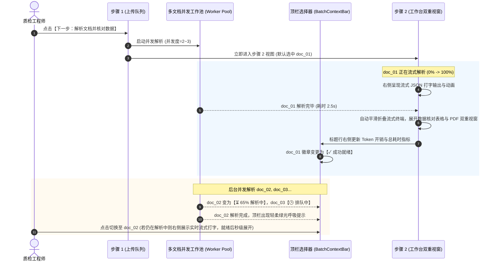

# 多文档异步并发解析与渐进式核对呈现方案 (方案 A 深度融合)

本方案基于与用户的深入对齐（`/grill-me` 决策结论），对“从步骤 1 到步骤 2 多文档异步并发解析（2~3 线程）+ 顶栏选择器深度融合进度 + 标题行右侧 Token 开销指标 + 首单流式就绪即刻核对 + 未就绪文档切换动态承接”进行全景架构与交互落地设计。

---

## 一、核心交互与状态流转设计



---

## 二、视觉与组件层改造明细

### 1. 顶栏统一批次选择器改造 (`BatchContextBar.tsx`)
- **标题行右侧额外插槽 (`rightExtraAction`) 激活**：
  - 在 `步骤 2: 核对解析数据` 标题右侧，展示**当前 Session 的累计 Token 开销与总耗时**（随各文档并发解析完成实时累加）：
    ```tsx
    <div className="flex items-center gap-2 text-xs font-medium text-on-surface-variant">
      <span className="flex items-center gap-1 bg-surface-container-high dark:bg-surface-dark-high px-2.5 py-1 rounded-md font-mono text-on-surface dark:text-surface-bright">
        <span className="material-symbols-outlined text-[14px] text-primary dark:text-primary-fixed-dim">memory</span>
        <span>累计开销: 输入 {sessionTotalTokens.input.toLocaleString()} / 输出 {sessionTotalTokens.output.toLocaleString()}</span>
      </span>
      <span className="flex items-center gap-1 bg-surface-container-high dark:bg-surface-dark-high px-2.5 py-1 rounded-md font-mono text-on-surface dark:text-surface-bright">
        <span className="material-symbols-outlined text-[14px] text-emerald-600 dark:text-emerald-400">timer</span>
        <span>总耗时 {sessionTotalDuration.toFixed(1)}s</span>
      </span>
      {/* 展开/折叠大模型原始输出切换按钮（无 emoji） */}
      <button 
        type="button"
        onClick={toggleStreamingTerminal} 
        className="flex items-center gap-1 text-xs text-primary dark:text-primary-fixed-dim font-bold hover:underline ml-1"
      >
        <span>{isExpanded ? '收起大模型流水' : '查看大模型流水'}</span>
        <span className="material-symbols-outlined text-sm">
          {isExpanded ? 'expand_less' : 'expand_more'}
        </span>
      </button>
    </div>
    ```
- **文档选择器下拉菜单深度融合多状态（严格采用 Material Symbols 与文本，杜绝 emoji）**：
  - 每份文档右侧带有微状态胶囊：
    - `成功就绪 (3炉批)`：带 `check_circle` 图标与绿色背景；
    - `解析中 (65%)`：带 `progress_activity` 旋转动画图标与蓝色背景；
    - `排队等待中`：带 `schedule` 图标与柔和灰色背景；
    - `解析异常`：带 `error` 图标与红色重试按钮。
  - 下拉框顶部汇总全局状态：`正在并发解析 (2/4) · 1 份已就绪可核对`。

### 2. 步骤 2 动态解析与流式终端 (`LlmStreamingTerminal`)
- **内嵌于步骤 2 的顶部或右侧工作区**：
  - 当选中的文档处于 `parsing` 状态时：
    - 左侧正常展示该文档的源 PDF；
    - 右侧展示暗黑工业风终端窗口，流式打字输出提取的 JSON 结构，并自动平滑向下滚动；
  - 当解析进度达到 100% 且输出结束：
    - 延迟 800ms，流式终端自动平滑折叠向上收拢为一行紧凑条；
    - 下方数据核对与编辑表格平滑展开，用户可即刻对实测值进行修改和核对；
  - 质检员可随时点击顶栏的 `[查看大模型流水 ∨]` 重新展开查看。

### 3. 多文档并发状态机与调度管理器 (`useDocumentParser`)
- 管理并发上限 `MAX_CONCURRENCY = 2`；
- 维护每份文档的独立状态、流式输出缓存、Token 统计与解析进度；
- 提供 `onSelectDoc` 时的状态派发与无缝响应。

---

## 三、涉及改动文件清单

### [NEW] [src/hooks/useDocumentParser.ts](file:///Users/shiromaple/Github/NormScale/src/hooks/useDocumentParser.ts)
- 异步并发调度 Hook：管理多文档任务队列、流式打字模拟器与状态流转。

### [MODIFY] [src/components/BatchContextBar.tsx](file:///Users/shiromaple/Github/NormScale/src/components/BatchContextBar.tsx)
- 在标题行右侧渲染 Token 开销指标与展开/收起开关；
- 在文档下拉菜单项中展示解析进度环与多状态胶囊。

### [MODIFY] [src/components/WaterfallWorkbench.tsx](file:///Users/shiromaple/Github/NormScale/src/components/WaterfallWorkbench.tsx)
- 接入 `useDocumentParser`，支持首单即刻核对与流式终端平滑自动折叠。

---

## 四、验证计划

1. **多文档并发流转测试**：
   - 步骤 1 上传/选取多份文档后点击进入步骤 2；
   - 观察 doc_01 立即在步骤 2 呈现流式打字，2.5s 后自动折叠并展开核对表格；
2. **顶栏选择器交互测试**：
   - 查看标题右侧的 Token 开销与耗时；
   - 打开文档下拉框，查看正在解析文档的旋转进度环与已就绪文档的绿色标记；
   - 主动切换至一份“解析中”的文档，验证是否即时展示该文档的流式输出窗口，就绪后平滑展开为表格；
3. **TypeScript 校验**：
   - 执行 `pnpm typecheck` 验证 0 错误。
