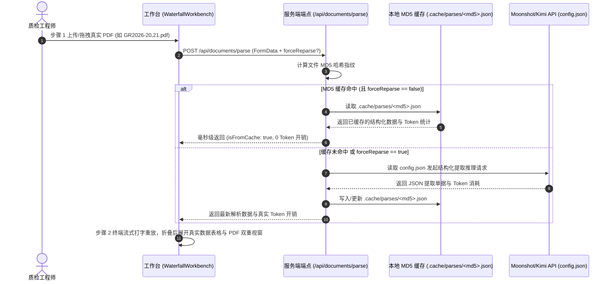

# Phase 9 实施计划：真实文档解析、Moonshot/Kimi 模型直连与 MD5 抽取结果持久化缓存引擎

本方案旨在实现工业质保书从前端上传真实 PDF/图片、服务端计算文件 MD5 存证指纹、基于 `config.json` 调用 Moonshot/Kimi 大模型直连结构化抽取，到 MD5 解析结果本地 JSON 持久化缓存与步骤 2 真实数据承接的全链路闭环。

---

## 一、系统架构与数据流转



---

## 二、功能模块拆解与具体实现

### 1. 本地 MD5 解析结果缓存仓储 (`src/repository/parse-cache-store.ts`)
- **存储路径**：`.cache/parses/<md5>.json`；
- **存储结构契约**：
  ```ts
  export interface CachedParseResult {
    md5: string;
    filename: string;
    fileSize: string;
    model: string;
    parsedAt: string;
    tokenStats: {
      inputTokens: number;
      outputTokens: number;
      durationSeconds: number;
      isFromCache: boolean;
    };
    rawStreamingJson: string;
    sessionDocument: SessionDocument;
    bboxes: FieldBBox[];
  }
  ```
- **核心 API**：
  - `get(md5: string): CachedParseResult | null`
  - `set(md5: string, data: CachedParseResult): Promise<void>`
  - `has(md5: string): boolean`
  - `delete(md5: string): boolean`

### 2. Moonshot / Kimi 大模型直连抽取适配器 (`src/extractor/moonshot-extractor.ts`)
- **配置读取**：自动加载根目录 `config.json` 中的 `llm.configs`（`standard` / `highspeed`）与 `pricing`；
- **API 凭证注入**：从 `process.env.MOONSHOT_API_KEY`、`process.env.KIMI_API_KEY` 或 `config.json` 中配置的 API 密钥读取；
- **提取提示词与 Schema 对齐**：构造工业级 MTC 结构化抽取 Prompt，解析抬头（标准、牌号、炉号、批号）与全部化学成分、力学性能、工艺和探伤检验项；
- **严格错误门禁（严禁静默拟真降级）**：
  - 若未配置有效 API Key 或模型服务调用异常（网络超时、鉴权失败、配额不足等），**绝对不做任何假数据/拟真降级**；
  - 直接向上抛出具名异常并返回结构化错误信息，阻断解析任务，提示质检员：`“未检测到有效的大模型 API 凭证或服务不可用，请联系系统管理员维护大模型配置”`。

### 3. 文档解析与上传 API 端点 (`src/app/api/documents/parse/route.ts`)
- **路由方法**：`POST /api/documents/parse`
- **请求入参**：`multipart/form-data`（包含 `file` 文件流或 `sampleId`，以及可选的 `forceReparse` 布尔值）；
- **缓存优先与阻断判断逻辑**：
  1. 计算文档 `md5` 并在本地缓存 `.cache/parses/<md5>.json` 中检索；
  2. 若 **MD5 命中缓存**（且 `forceReparse !== true`）：直接返回缓存结果（`isFromCache: true`，耗时 0.1s，0 Token 开销）；
  3. 若 **未命中缓存** 或 `forceReparse === true`：
     - 校验系统大模型 API Key 配置；若未配置，**立即终止并返回 HTTP 400/503 错误**，明确提示缺少 API 凭证；
     - 调用 `MoonshotExtractor` 执行真实推理；若 API 返回失败，同样向前端抛出真实错误原因，绝不填充伪造数据；
     - 推理成功后，将结果写入 `.cache/parses/<md5>.json` 并返回前端。

### 4. 前端工作台真实文件上传与缓存联动 (`WaterfallWorkbench.tsx` & `useDocumentParser.ts`)
- **步骤 1 真实文件选取**：大虚线框支持真正的 `<input type="file" accept=".pdf,image/*">` 点击与拖拽上传；
- **缓存微感知与强制重新解析**：
  - 若命中缓存，Token 栏显示：`输入 0 / 输出 0 Tokens (缓存复用) · 耗时 0.1s`；
  - 步骤 2 标题栏旁提供 `[重新解析]` 按钮，允许用户主动传入 `forceReparse: true` 覆盖更新缓存；
- **多文档异步并发池升级**：`useDocumentParser` 通过调用 `/api/documents/parse` 接入真实数据。

---

## 三、涉及改动文件清单

### [NEW] [src/repository/parse-cache-store.ts](file:///Users/shiromaple/Github/NormScale/src/repository/parse-cache-store.ts)
- 本地 MD5 解析结果 JSON 文件持久化缓存存储层。

### [NEW] [src/extractor/moonshot-extractor.ts](file:///Users/shiromaple/Github/NormScale/src/extractor/moonshot-extractor.ts)
- 基于 `config.json` 的 Moonshot / Kimi 大模型结构化抽取适配器。

### [NEW] [src/app/api/documents/parse/route.ts](file:///Users/shiromaple/Github/NormScale/src/app/api/documents/parse/route.ts)
- 服务端文档上传、MD5 计算、缓存读写与大模型抽取 HTTP Route Handler。

### [MODIFY] [src/hooks/useDocumentParser.ts](file:///Users/shiromaple/Github/NormScale/src/hooks/useDocumentParser.ts)
- 将流式模拟器升级为调用 `/api/documents/parse` 真实端点，支持 MD5 缓存感知与强制重新解析。

### [MODIFY] [src/components/WaterfallWorkbench.tsx](file:///Users/shiromaple/Github/NormScale/src/components/WaterfallWorkbench.tsx)
- 步骤 1 开放真实文件选择与拖拽，步骤 2 支持真实切图与数据渲染，增加“重新解析”操作。

---

## 四、验证计划

### 1. 自动化与类型校验
- 运行 `pnpm typecheck` 保证 TypeScript 严格模式 0 错误。

### 2. 功能与缓存验证
- **首次上传**：在步骤 1 上传 `docs/test/GR2026-20,21.pdf`，观察服务端计算 MD5 并生成 `.cache/parses/<md5>.json`；
- **二次上传（缓存命中）**：再次上传同一文件，观察界面在 0.1s 内秒级就绪，Token 显示为缓存复用（0 Token）；
- **强制重解析**：点击【重新解析】，验证是否能正常刷新并更新 `.cache/parses/<md5>.json`。
