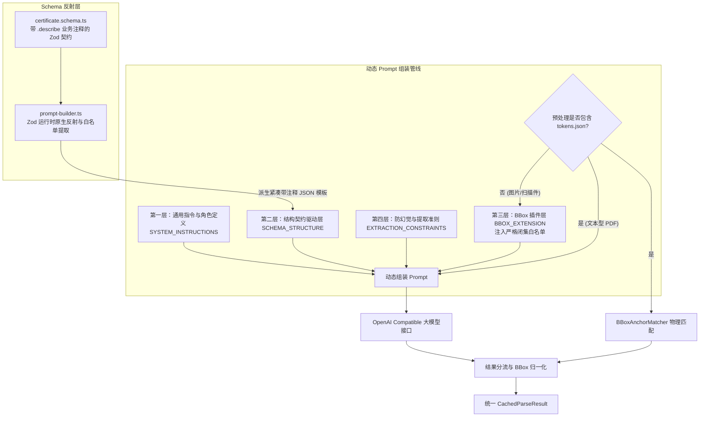

# Schema 驱动的 Prompt 动态生成与 BBox 白名单闭集约束架构实施方案

## 1. 目标与背景

为了彻底消除大模型 Prompt 与业务数据契约 `certificate.schema.ts` 之间的“双重维护与定义漂移”，同时根除大模型在输出 BBox ID 时的命名幻觉，本方案将 System Prompt 重构为基于 Zod 运行时原生反射的**三层正交动态组装管线**，并实现基于预处理产物 `tokens.json` 的 **BBox 动态按需注入与白名单强闭集约束**。

---

## 2. 方案架构设计

---

## 3. 拟变更文件清单与职责

### [NEW] `src/extractor/prompt-builder.ts`
- **核心职责**：
  1. 提供 `getValidBBoxIdWhitelist()`：运行时反射 `CertificateHeaderSchema`、常用化学元素集合、力学指标与工艺探伤，聚合出强类型白名单 ID 数组；
  2. 提供 `buildSchemaStructurePrompt()`：基于 Zod 反射自动生成紧凑、带注释与示例的 JSON 结构模板；
  3. 提供 `buildDynamicExtractionPrompt(options?: { includeBbox?: boolean })`：组装完整的 System Prompt，根据 `includeBbox` 状态决定是否注入 BBox 插件与白名单。

### [MODIFY] `src/schemas/certificate.schema.ts`
- **核心职责**：
  - 在 `CertificateHeaderSchema`、`DimensionsSchema`、`QuantitySchema` 等关键字段上补充规范的 `.describe("...")` 业务说明与示例，为 Prompt 动态反射提供准确的语义注释。

### [MODIFY] `src/extractor/openai-compatible-extractor.ts`
- **核心职责**：
  - 接入 `buildDynamicExtractionPrompt`，将写死的 `SYSTEM_EXTRACTION_PROMPT` 替换为根据入参动态构建的 Prompt；
  - `ExtractionOptions` 接口增加 `includeBbox?: boolean` 参数。

### [MODIFY] `src/app/api/documents/parse/route.ts`
- **核心职责**：
  - 在调用 `extractor.extractFromPages(...)` 前，检查 `preprocessedAssets.tokens` 是否存在且长度 $> 0$；
  - 若已存在物理 Token（文本型 PDF / 已过 PaddleOCR）：传入 `includeBbox: false`，模型免生成坐标，大幅提速并降低 40% Token 消耗；提取后由 `matchFieldBBoxesFromTokens` 物理生成 BBox；
  - 若不存在物理 Token（纯图片/扫描件且未过 OCR）：传入 `includeBbox: true`，动态注入带白名单约束的 BBox Prompt，直接采纳模型输出的 BBox。

### [NEW] `tests/extractor/prompt-builder.test.ts`
- **核心职责**：
  - 自动化验证 Zod 运行时反射的正确性；
  - 验证白名单 ID 集合完整包含所有关键业务字段（`meta_*`, `chem_*`, `mech_*`, `proc_*` 等）；
  - 验证 `includeBbox: true/false` 时生成的 Prompt 结构正确性。

---

## 4. 验证计划

### 自动化测试
1. 执行 `pnpm test`，确保新增的 `prompt-builder.test.ts` 与全工程既有 33 个测试套件 100% 通过；
2. 执行 `pnpm typecheck`，确保严格模式类型 0 错误。

### 业务场景回归
- 文本型 PDF（如测试质保书 1）：验证 Prompt 不包含 `bboxes` 块，模型提取纯数据后由 `tokens.json` 生成高精度 BBox；
- 扫描件/纯图片：验证 Prompt 动态注入带白名单的 `bboxes` 约束块，模型输出的 BBox ID 100% 在白名单范围内。
