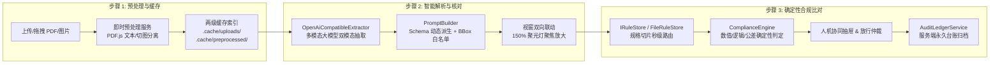

# NormScale 阶段性技术总结与 Agent 交接文档

> **文档定位**：本文档旨在为接手 NormScale 项目的后续 Agent / 开发者提供全景式的系统架构理解、当前工程进展、核心设计决策、待办事项清单与关键开发红线，确保无需重复推导即可无缝进入后续开发。

---

## 一、 项目背景与系统定位

**NormScale** 是一套面向工业物资采购与质检场景的**质量证明书（MTC / Mill Test Certificate）合规检验引擎与智能比对系统**。

### 1. 核心业务痛点

- 工业采购中，各钢厂、法兰/管件制造厂出具的质量证明书排版格式各异、包含多炉批/多试样，且引用国家标准（如 GB/T 13296）、能源行业标准（如 NB/T 47019.5）或企业订货技术条件；
- 传统人工质检验收耗时费力、极易漏检；通用文档提取工具（如 DocEx）仅能完成单向信息提取，无法承载涉及**跨标准前置条件路由、数值区间修约比对、多项严苛交集判定与质量事故阻断**的强状态业务流。

### 2. 技术栈契约 (Strict Constraints)

- **Runtime & Framework**：Node.js 22 LTS, Next.js 15 (App Router, React 19)
- **Language**：TypeScript (Strict Mode enabled, 严格禁止 `any`)
- **Package Manager**：**严格仅使用 `pnpm`**（严禁执行 `npm` / `yarn` / `npx`）
- **State & Workflow**：LangGraph (`@langchain/langgraph`), React Hooks
- **High-Precision Math**：`bignumber.js` (严格执行 GB/T 8170 数值修约)
- **Styling**：Tailwind CSS + Material Symbols
- **Testing**：Vitest (当前 34 套件，148 个测试用例 100% 通过)

---

## 二、 系统架构与核心工作流

系统整体采用**“四步瀑布式工作台（Waterfall Workbench）”**与**“双轨核验架构（确定性规则为主 + 语义 RAG 为辅）”**：



### 1. 步骤 1：文档预处理与两级缓存索引

- **即时预处理落盘 (`POST /api/documents/preprocess`)**：用户选定文件瞬间，前端即时分离文本至 `text.txt` 并逐页渲染 2.0x Retina PNG 高清切图，分别落盘至 `.cache/uploads/{md5}.{ext}` 与 `.cache/preprocessed/{md5}/`；
- **两级缓存策略**：
  - **第一级（解析级缓存）**：若存在该 MD5 且 `parserConfigVersion` 一致的解析记录，秒级复用（0 Token 消耗）；
  - **第二级（预处理级缓存）**：若强制重析或配置版本失效，直接复用已有的切图与文本重新请求模型，免除大文件重复上传与重复切图；
- **配置项版本失效门禁 (`parserConfigVersion`)**：修改 Schema 或 Prompt 时在 `config.json` 递增版本号，旧解析缓存自动安全失效并平滑重析。

### 2. 步骤 2：智能结构化提取与交互式核对

- **Schema-Driven 动态 Prompt 构建 (`prompt-builder.ts`)**：以 `src/schemas/certificate.schema.ts` 为唯一真理源，通过 Zod 运行时原生反射全自动派生结构模板与字段注释；
- **BBox 白名单闭集强约束**：自动提取合法的字段 ID（`meta_*`, `chem_*`, `mech_*`, `proc_*`），在 Prompt 中以封闭枚举白名单约束大模型，彻底消除 ID 命名幻觉；
- **交互式核对视窗 (`WaterfallWorkbench.tsx`)**：
  - 支持多炉批切换与字段实时编辑；
  - 左右双向 Hover 联动：右侧 Hover 字段，左侧对应 BBox 即时高亮并在 1000ms 后平滑触发 **150% 视网膜级聚光灯居中放大**；左侧 Hover BBox，右侧自动滚动至对应卡片并点亮光晕。

### 3. 步骤 3：全景规则比对与台账持久化

- **确定性计算引擎 (`ComplianceEngine`)**：
  - 数值范围与高精度修约比对（`numeric-evaluator`）；
  - 跨元素动态化学公式判定（如 $Ti \ge 4 \times (C+N)$，`dynamic-evaluator`）；
  - 阶梯口径公差计算（`tolerance-evaluator`）；
  - 多选一与替代检验逻辑组判定（`logic-evaluator`）；
- **人机协同抽屉 (HITL Drawer)**：支持质检员对存疑项进行人工裁决、签署放行意见，实现“系统判定”与“人工复核”双轨留痕；
- **服务端正式台账归档 (`AuditLedgerService` & `POST /api/audit/save`)**：剥离大体积 Base64 切图，仅持久化纯结构化检验结果与 MD5 指针至 `.cache/audit/{sessionId}.json`，彻底废除不可靠的客户端 localStorage。

---

## 三、 近期关键攻坚成果与架构重构 (2026-09-02)

1. **彻底拔除全工程 Mock 样本伪哈希与 `filename` 依赖陷阱**：
   - 彻底删除 `preset-sample-${sampleId}` 和 `default-sample-${filename}` 等 POC 时期遗留伪分支；
   - 确立**纯 MD5 内容寻址**为全系统唯一凭据，严禁用 `filename` 进行缓存去重、相等匹配或删除；
2. **Schema 驱动的 Prompt 动态生成与 BBox 白名单闭集约束落地**：
   - 建立 `src/extractor/prompt-builder.ts`，彻底消除硬编码 Prompt 与 `certificate.schema.ts` 之间的双重维护与定义漂移；
3. **BBox 多维双向别名容错与聚焦放大链路健全**：
   - 在前端建立 `FIELD_ID_ALIASES` 字典与 `isFieldIdMatch` 算法，抹平历史别名（如 `meta_standard` ⇄ `meta_declaredStandard` ⇄ `standard`），确保 100% 触发聚光灯放大；
4. **BBox 生成策略收敛与演进定调**：
   - 鉴于 PDF.js 导出的矢量文本 Token 碎片化严重导致反向匹配脱靶，现阶段统一在 Prompt 中注入白名单约束，由多模态大模型直接解析输出视觉 `bboxes`，`tokens.json` 留作缺省兜底。

---

## 四、 核心代码目录索引

```text
NormScale/
├── cairn/                            # Project Cairn 项目知识与演进沉淀层
│   ├── architecture.md               # 系统核心架构基准、设计决策与反硬编码规范 (必读)
│   ├── LOG.md                        # 按时间倒序的项目演进日志 (最新在顶部，单条≤20行)
│   ├── ROADMAP.md                    # 项目路线图、当前焦点与开放决策
│   └── multi-standard-engine.md      # 多标准引用规则叠加与双标尺设计规范 (Phase 10 核心)
├── data/
│   └── standards/                    # 国家/行业标准规则库 (GB/T 13296, NB/T 47019.5 等)
│       └── <STD>/slices/*.json       # 通用规格切片 (Specification Slice)
├── src/
│   ├── app/                          # Next.js App Router 页面与 API 端点
│   │   ├── api/documents/preprocess/ # 步骤 1 即时预处理落盘端点
│   │   ├── api/documents/parse/      # 步骤 2 结构化提取与两级缓存调度端点
│   │   ├── api/documents/cached/     # 历史缓存清单检索与级联清理端点
│   │   └── api/audit/save/           # 步骤 3 正式台账服务端归档端点
│   ├── components/
│   │   └── WaterfallWorkbench.tsx    # 核心四步瀑布式质检工作台 (单体高度内聚 UI)
│   ├── engine/                       # 核心确定性计算与规则核验引擎 (纯代码, 0 幻觉)
│   │   ├── compliance-engine.ts      # 合规判定主调度器
│   │   ├── numeric-evaluator.ts      # 数值区间核验与 GB/T 8170 修约
│   │   ├── dynamic-evaluator.ts      # 跨元素公式动态求值
│   │   └── tolerance-evaluator.ts    # 阶梯几何公差动态求值
│   ├── extractor/                    # MTC 质保书提取适配层
│   │   ├── prompt-builder.ts         # Schema 驱动的 Prompt 动态构建器与白名单反射器
│   │   ├── openai-compatible-extractor.ts # OpenAI 兼容多模态大模型直连适配器
│   │   └── document-preprocessor.service.ts # 预处理切图与文本分离落盘服务
│   ├── repository/                   # 规则仓储与缓存仓储 (IRuleStore, ParseCacheStore)
│   ├── schemas/                      # Zod 数据契约 (唯一真理源，带 .describe 注释)
│   │   ├── certificate.schema.ts     # 质保书数据契约模型
│   │   └── standard.schema.ts        # 标准规则元模型
│   └── utils/
│       ├── bbox-matcher.ts           # 智能文本锚点 BBox 匹配引擎 (兜底)
│       └── pdf-renderer.ts           # 客户端 PDF.js 矢量文本分析与 2.0x Retina 渲染
└── tests/                            # 自动化测试套件 (34 个套件，148 个测试，100% 覆盖)
```

---

## 五、 下一阶段核心待办事项 (Next Steps & Backlog)

### 1. 当前焦点：Phase 10 - 多标准引用规则叠加与双标尺透明追溯引擎 (上线前必达 / Pre-launch Mandatory)

- **业务场景**：同一份工业质保书同时声称引用《GB/T 13296-2023》（通用产品标准）与《NB/T 47019.5-2021》（锅炉压力容器技术条件）；
- **核心算法需求**：
  - 实现 `composeMultiStandardSlices()` 纯函数切片合成器；
  - 遵循**“检验项目取并集、共有指标取严苛交集（包络线原则 / Strict Superiority）”**算法；
  - 例如：若标准 A 规定 $C \le 0.08\%$，标准 B 规定 $C \le 0.03\%$，合成规则必须收敛为 $C \le 0.03\%$；
- **双标尺追溯**：在步骤 3 的全景矩阵与核验报告中，清晰透出“双标准对比依据”与“剪刀差归因”，明确责任边界；
- **设计依据文档**：详见 [`cairn/multi-standard-engine.md`](file:///c:/Users/gaoft/Documents/CodeSpace/NormScale/cairn/multi-standard-engine.md) 与 [`cairn/dual-track-verdict.md`](file:///c:/Users/gaoft/Documents/CodeSpace/NormScale/cairn/dual-track-verdict.md)。

### 2. Phase 11: 扫描件 PaddleOCR 接入与多品类标准扩充

- **后端 PaddleOCR 接入**：在 Node.js 端通过 ONNX Runtime 接入轻量 PaddleOCR 模型，用于扫描件/纯图片（`isTextBased === false`）的物理字符检测与版面分块，产出统一规范的 `tokens.json`；
- **标准规则库扩充**：横向录入板材（如 GB/T 4237）、锻件（如 NB/T 47010）等多品类工业标准。

---

## 六、 协作者必须严格遵守的开发红线 (Critical Rules)

1. **最小爆炸半径原则 (Minimal Blast Radius)**：
   - 仅修改解决当前任务所必需的最少文件与代码行，**绝对禁止顺带重构无关函数或全量重写已有稳定模块**。
2. **Zero-Mock by Default (坚守真实生产级底线)**：
   - 严禁为了演示效果在代码中编写 `if (docId === 'xxx')` 或特定样本的 hardcoded fallback；未提取字段严格留空（`''`）并显示 `placeholder="--"`。
3. **严格的内容寻址 (Content-Addressed MD5 Only)**：
   - 缓存 Key、落盘目录与单据去重 **100% 严格基于文件二进制 MD5**，`filename` 仅作为展示字段，绝不能用于任何判等或删除逻辑。
4. **包管理工具门禁 (pnpm Only)**：
   - **绝对禁止执行 `npm`、`yarn`、`npx`**；必须使用 `pnpm add` / `pnpm test` / `pnpm typecheck` / `pnpm dlx`。
5. **Project Cairn 协作与完成门禁**：
   - 取得实质性进展后，必须在 `cairn/LOG.md` 顶部追加记录（≤20行），并将最终结论原地沉淀至 `cairn/<topic>.md`；
   - 在做出任何完成声明前，必须执行 `pnpm typecheck` 与 `pnpm test` 并确认 100% 通过。
