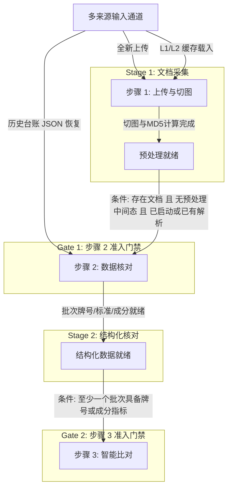

# 工作台全局门禁心智模型与多源数据生命周期统一方案

## 1. 核心矛盾与问题诊断

在引入文件切图预处理与防抢跑机制后，系统在 `goToStep` 导航控制中引入了局部状态校验：
```ts
if (!session.documents || session.documents.length === 0 || queuedDocs.length === 0) { ... }
```
这暴露了一个深层次的**概念错位（Subject Mismatch）**：
- **错位点**：混淆了「步骤 1 局部 UI 瞬态采集视窗（`queuedDocs`）」与「系统全局业务领域实体（`session.documents`）」。
- **失效场景**：
  当用户从“历史台账（AuditLedger）”点击【查看/复核】时，历史检验会话（包含完备的文档切图、抽取批次、化学与力学指标、比对结论）直接被载入为 `loadedSession` 并写入 `session`。
  由于历史会话不需要经历步骤 1 的手工拖拽上传，`queuedDocs` 自然为空。此时用户在步骤 2 核对完数据后，点击右下角【核对完成，比对标准】或顶部步骤 3 锚点，会被错误地拦截：*“请先在步骤 1 上传或选择待检验文档”*，导致整个流转被卡死在步骤 2。

---

## 2. 全局门禁心智模型体系 (Mental Model)

为彻底解决门禁混乱，建立统一、清晰、符合产品直觉的心智模型，我们确立以下三大设计准则：

### 2.1 单一真相源（Single Source of Truth, SSOT）
- **全局真理**：`session.documents` 是全检验生命周期的唯一事实标准。
- **瞬态视窗**：`queuedDocs` 仅是步骤 1 处理用户手工上传、本地文件拖拽及切图预处理进度条的局部展示缓存。
- **全渠道双向投影（Bidirectional Projection）**：
  无论数据通过何种渠道注入：
  1. **本地全新上传**：文件 -> 预处理完成 -> 写入 `queuedDocs` -> 启动会话时归集入 `session.documents`；
  2. **从历史缓存恢复（L1/L2）**：载入 `sessionDocument` 同时双向更新 `queuedDocs`；
  3. **历史台账恢复（AuditLedger）**：载入 `loadedSession` 时，不仅更新 `session`，同时**自动将 `loadedSession.documents` 投影一份到 `queuedDocs`**（状态打标为 `已命中解析缓存`）。
  > **收益**：彻底消除“从台账恢复后点回步骤 1 发现队列空空如也”的割裂感与心理恐慌，全工作台数据视图实现自洽。

---

### 2.2 阶段产物就绪度原则（Stage Gate by Artifact Readiness）

门禁准入只校验当前工序所需的**阶段产物是否就绪**，绝不依赖来源渠道：



#### 门禁判定规则表

| 目标工序 | 核心门禁判定条件 | 阻断时的引导体验 |
|---|---|---|
| **步骤 1（上传准备）** | 无条件始终开放，支持随时回退查看或追加文档 | - |
| **步骤 2（数据核对）** | 1. 存在文档：`session.documents.length > 0 \|\| queuedDocs.length > 0`<br>2. 预处理完成：`!isAnyDocPreprocessing`<br>3. 已有解析或正在解析：`hasParsedDocs \|\| hasAnyParsingTask` | - 若无任何文档：提示“请先在步骤 1 上传或选择待检验文档”<br>- 若仍在预处理：提示“文档切图与文本正在预处理中，请稍候...”<br>- 若在步骤 1 尚未启动：引导点击“解析文档，核对数据” |
| **步骤 3（智能比对）** | 至少有一个批次具备有效结构化属性：<br>`session.documents.some(d => d.batches.some(b => b.grade \|\| b.standard \|\| b.chemical?.length > 0 \|\| b.mechanical?.length > 0))` | - 若完全未提取出批次信息：友好提示“请先在步骤 2 核对并录入批次牌号或成分数据，再进入标准比对” |

---

## 3. 代码改造实现细节

### 3.1 历史台账恢复双向投影 (`WaterfallWorkbench.tsx`)
```tsx
useEffect(() => {
  if (loadedSession) {
    setSession(loadedSession);
    const firstDoc = loadedSession.documents[0];
    if (firstDoc) {
      setSelectedDocId(firstDoc.docId);
      const firstBatch = firstDoc.batches[0];
      if (firstBatch) {
        setSelectedBatchNo(firstBatch.batchNo);
      }
    }
    // 双向投影至 queuedDocs，确保步骤 1 队列与全局会话保持同步，消除空队列假象
    const projectedDocs: QueuedDocItem[] = (loadedSession.documents || []).map(d => ({
      id: d.docId,
      filename: d.filename,
      status: '已命中解析缓存',
      size: d.fileSize ? (typeof d.fileSize === 'number' ? `${Math.round(d.fileSize / 1024)} KB` : String(d.fileSize)) : '已归档',
      date: new Date(loadedSession.createdAt || Date.now()).toLocaleDateString('zh-CN'),
      md5: d.md5,
      pageCount: d.pageCount || d.pages?.length || 1,
    }));
    setQueuedDocs(projectedDocs);
    setCurrentStep(1); // 自动进入 Step 2 进行核对
  }
}, [loadedSession]);
```

### 3.2 `goToStep` 导航门禁解耦重构 (`WaterfallWorkbench.tsx`)
```tsx
const goToStep = (stepIdx: number) => {
  if (stepIdx > 0) {
    const hasAnyDocs = (session.documents && session.documents.length > 0) || queuedDocs.length > 0;
    if (!hasAnyDocs) {
      showToast('请先在步骤 1 上传或选择待检验文档', 'info');
      return;
    }
    if (isAnyDocPreprocessing) {
      showToast('文档切图与文本正在预处理中，请稍候...', 'info');
      return;
    }

    // 目标为步骤 3（比对标准）：以结构化数据产物就绪度为准
    if (stepIdx === 2) {
      const hasValidBatchData = session.documents?.some(d =>
        d.batches?.some(b => Boolean(b.grade || b.standard || (b.chemical && b.chemical.length > 0) || (b.mechanical && b.mechanical.length > 0)))
      );
      if (!hasValidBatchData) {
        showToast('请先在步骤 2 核对并录入批次牌号或成分数据，再进入标准比对', 'info');
        return;
      }
    } else if (stepIdx === 1) {
      // 目标为步骤 2（核对数据）：已有解析产物或处于流式解析任务中放行
      const hasAnyTask = Object.keys(parsingTasks).length > 0;
      const hasParsedDocs = session.documents?.some(d => d.ocrStatus === 'DONE' || d.batches?.some(b => Boolean(b.grade || b.standard)));
      if (!hasAnyTask && !hasParsedDocs) {
        showToast('请点击右下角“解析文档，核对数据”以启动检验', 'info');
        return;
      }
    }
  }
  if (stepIdx >= 0 && stepIdx <= 2) {
    setCurrentStep(stepIdx);
  }
};
```

---

## 4. 契约测试与质量保障

新增独立契约测试 `tests/unit/step-guard-lifecycle.test.ts`，覆盖五大场景：
1. **未上传任何文档**：拦截进入步骤 2 和步骤 3；
2. **切图预处理中**：拦截防抢跑；
3. **历史台账恢复（队列为空，但 `session.documents` 完备）**：直接放行进入步骤 3；
4. **历史台账恢复后自由回退**：可随时回退至步骤 1 查看投影队列，也可再次进入步骤 2/3；
5. **文档仅切图未解析**：阻止跳过步骤 2 直接进入步骤 3，并提供精准友好提示。

全量单测套件 53 个测试文件、263 项用例 100% 绿灯。
